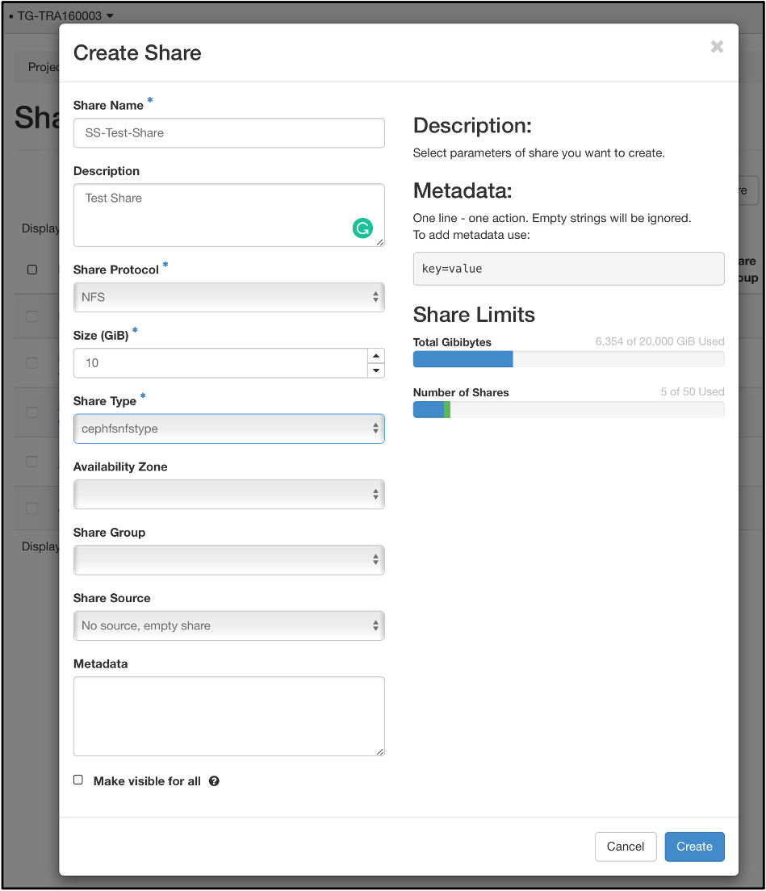
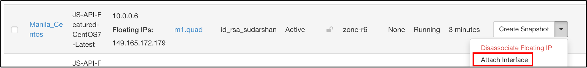

# Manila - Filesystems-as-a-service - on Jetstream2

Manila is a native Openstack project that provides shared filesytems for virtual machines. Manila is an offshoot of the Openstack Cinder project that provides volume storage for Openstack instances. Manila provides a way to make network filesytems available between VMs without needing to understand how to run and maintain a network file system (NFS) server.

If you have a need of shared volume/data space, Manila is likely a solution to this problem.

Prereqs: Make sure you have the nfs client installed on your instance.

For Ubuntu:

    *apt install nfs-common*

For Centos/Rocky:

    *yum install nfs-utils*

## To use Manila via Horizon

### Create the share

1. Click on:  Project  → Share → Shares → Create Share

     &nbsp;

2. Create a share with the following settings:
    - protocol - nfs,
    - share type - cephnfstype
    &nbsp;

    

### Add an interface on the Manila network to an instance

1. Click Compute → Instances screen

2. Click Attach Interface (under Create Snapshot tab at far right)

     &nbsp;

3. Attach to manila_testing (10.255.0.0/16) network.

     &nbsp;

4. The instance should show the interface.

    

### Attaching instance to the Manila network

1. On a running instance add an interface on the manila_testing network.
