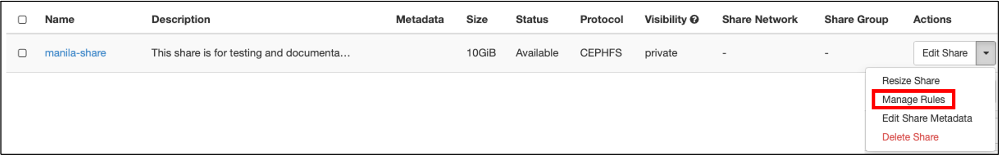
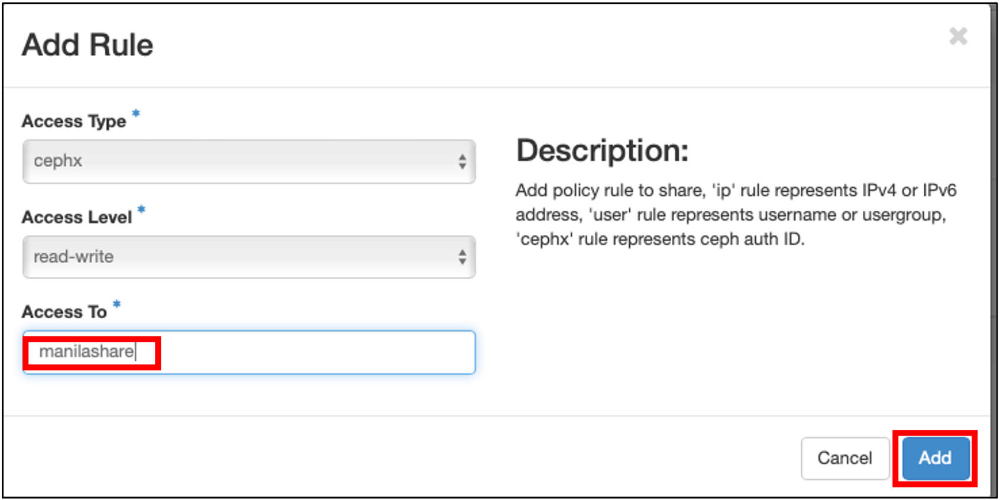
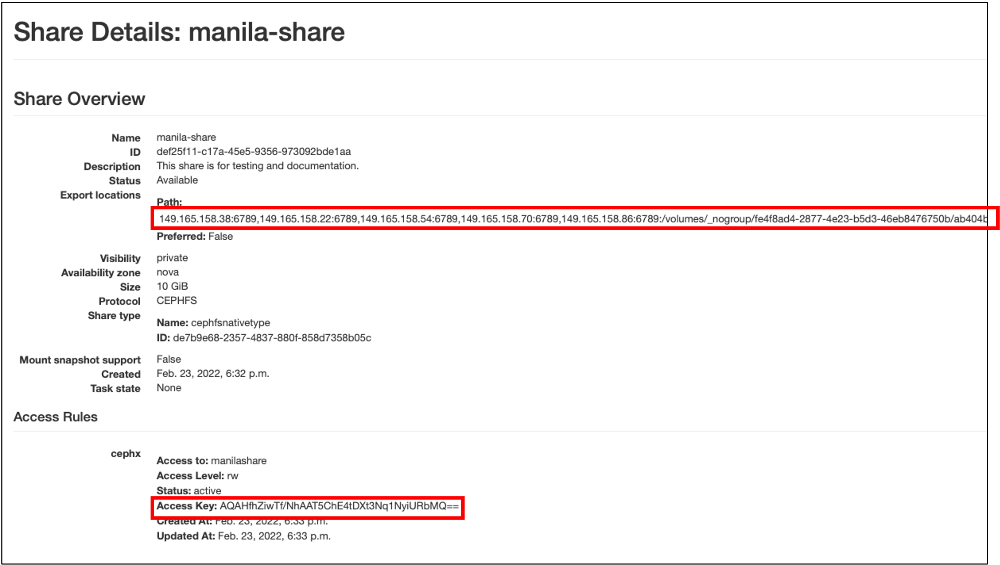

# Manila - Filesystems-as-a-service - on Jetstream2
 
Manila is the file share service project for OpenStack. Manila provides the management of file shares for example, NFS and CIFS, as a core service to OpenStack. Manila works with a variety of proprietary backend storage arrays and appliances, with open source distributed filesystems, as well as with a base Linux NFS or Samba server.
Prereqs: Make sure you have these packages installed on your instance: ceph-commons and ceph-fuse
 

## To use Manila via Horizon 
 
### Create the share

1. Click on:  Project  → Share → Shares → Create Share   
      
     &nbsp; 
  
2. Create a share with the following settings:
    - share name - a name of your choosing  
    - share protocol - CephFS    
    - size - the size of your manila share  
    - share type - cephnfsnativetype    
  
      
    &nbsp;  
    
3. Once your share is available you can select `Edit Share` and `Manage Rules` and `Add Rule` :  
   
      &nbsp;

    - access type - cephx  
    - access level - read-write  
    - access to - an arbitrary name (In this example it is `manilashare`)     
  
  
      &nbsp;
  

4. If you now go back to the share page (Project/Share/Shares) and click on the share you created you should see your share's metadata.  
    
    Important things to note here are :

    - Path - ips:ports followed by volume path (/volume/\_no-group/...)
    - Access Key     
  
    
   
      &nbsp;

 
