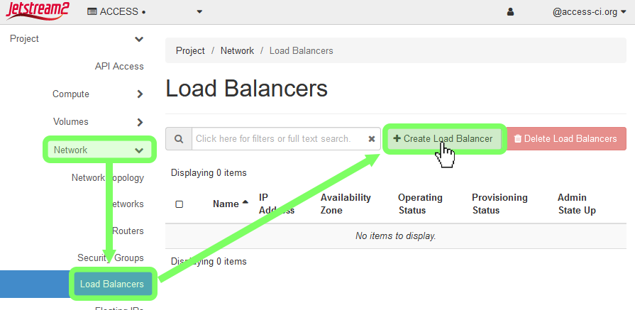
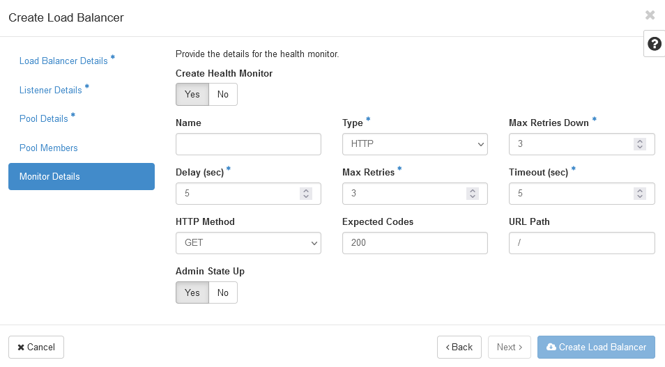

<style>
    img {
        margin-left: 20px;
    }
</style>
# Load Balancing with OpenStack Octavia

When designing a web application/service, it is often useful to distribute incoming requests between a pool of multiple (normally identical) backend workers. This is usually done for two primary reasons:

1. **Redundancy:** Should one of the workers fail, it can be removed from the pool, and the other(s) can continue to handle requests without a service interruption.
2. **Parallelization:** If requests loads are too high for one worker to handle, scaling horizontally allows multiple workers to handle them in parallel.

This practice is called "load balancing," and Load Balancing-as-a-Service (LBaaS) is currently offered on Jetstream2 via OpenStack Octavia.

---

## Creating a Basic Load Balancer

This guide will demonstrate how to create a load balancer in [Horizon](../ui/horizon/intro.md), but Octavia can also be managed from the [CLI](../ui/cli/overview.md) with the [Python Octavia Client](https://docs.openstack.org/python-octaviaclient/zed/)
{:.note}

Consider the simple service described by the following diagram, where a website is backed by a pool of two workers:


When a user fetches the site via its public IP (or resolved domain name), that request is routed through the load balancer, which intelligently decides which worker will ultimately fulfill the request. Here is how to create an example of such a service:

### 1. Create the workers

First things first, you will need something to actually serve the site. Create two Jetstream2 instances through your preferred method (for example [via Exosphere](../ui/exo/create_instance.md)).

- Name them something memorable, like `worker-node-1` and `worker-node-2`.
- Choose an instance flavor appropriate for your application--for this example, `m3.tiny` is good enough.
- If you create your instance outside of Exosphere, be sure that it is able to communicate over your desired port(s) by configuring it with the right [security groups](../ui/horizon/security_group.md). This example will use HTTP over port 80.

### 2. Configure a service on the workers

Now that we have instances to act as our workers, we need to actually have them serve something. For the sake of simplicity, let's just have them serve a plain HTML page with their respective number. Log into the first worker instance and execute this snippet:
```
sudo su -
mkdir /web
echo '<!DOCTYPE html><html><body><p>Hello from worker 1!</p></body></html>' > /web/index.html
screen -d -m python3 -m http.server --directory /web 80
```

Then, on the second worker, serve a slightly different page:
```
sudo su -
mkdir /web
echo '<!DOCTYPE html><html><body><p>Hello from worker 2!</p></body></html>' > /web/index.html
screen -d -m python3 -m http.server --directory /web 80
```

You should now notice that the instances are serving their basic page in a background process, which can be verified by running `curl <your-instances-public-ip>` from a local machine (or by visiting the instance's public IP in a browser).

**Note:** The worker instances do not actually need floating/public IP addresses to communicate through a load balancer!
{:.note} 

### 3. Create a load balancer

[Log into Horizon](../ui/horizon/login.md) and, from the left-hand menu, select `Network`→`Load Balancers`. Click on the `+ Create Load Balancer` button.

{width=500rem}

#### 3a. Load Balancer Details
In the first section ("Load Balancer Details"), enter the following options:

| Option | Value |
|--------|-------|
| Name | *Optional*: A descriptive name for your load balancer |
| IP address | *Optional*: If you want to manually specify a **local** ip, do so here |
| Description | *Optional*: Self-explanatory |
| Availability Zone | Leave this blank |
| Flavor | Leave this blank |
| Subnet | Select the subnet your workers are under. Usually this is `auto_allocated_network` |
| Admin State Up | Select `Yes` |

#### 3b. Listener Details

A listener describes what traffic your load balancer listens to. For instance, for a basic HTTP web server (like our example) would listen over HTTP port 80. For more information about each field, click the question mark icon in the top-right of the window. 

{width=500rem }

#### 3c. Pool Details

A pool is a collection of machines/resources that the load balancer can assign connections to. The most important option in this section is the `Algorithm`, as it changes how the load balancer determines which pool member to pass a given connection to. For our example, we will select `ROUND_ROBIN`.

| Algorithm | Explanation |
|-----------|-------------|
| `LEAST_CONNECTIONS` | Gives a new request/connection to the pool member with the least amount of active connections. |
| `ROUND_ROBIN` | Rotates between pool members one at a time, giving an equal share to each worker. |
| `SOURCE_IP` | Requests from a unique source IP address are consistently directed to the same instance. |

#### 3d. Pool Members

In this section, you can add instances to your pool. You should see that your worker nodes are available if you've selected the right subnet in `Load Balancer Details`. Click `Add` next to each of your workers, then specify what port your service is listening on (recall that for basic HTTP this will be `80`). 

You can also add workers to the pool that aren't Jetstream2/OpenStack instances by clicking `Add external member`, as long as there is a route from the load balancer to the external worker.

#### 3e. Monitor Details

{ align=right ; width=50%}

A health monitor is used by the load balancer to determine the operational state of pool members by sending out a "heartbeat" ping/request on a regular interval. If a worker fails to respond to the health check, requests are not routed to it.

For our example, we want to set up a health monitor of type HTTP that `GET`s the root URL path (`/`) every 5 seconds; if the request times out or returns anything other than `200 OK` more than 3 times in a row, the pool member's status is flagged.
{: .clearfix}

### 4. Assign the load balancer a floating IP

If you want the service your load balancer sits in front of to be accessible without configuring something like a reverse proxy, you can assign the load balancer a floating (public) IP address. To do so, navigate back to the Load Balancers page in Horizon, click the dropdown arrow next to your load balancer, then click `Associate Floating IP`. If your project already has floating IPs allocated to it, you can select a specific one; otherwise, select the `public` floating IP pool, and hit `✓ Associate`.

### 5. Test it out

Now that everything is put together, test it out! `curl` your load balancer's floating IP address, and observe the response:

```
curl <floating-ip>
<!DOCTYPE html><html><body><p>Hello from worker 1!</p></body></html>

curl <floating-ip>
<!DOCTYPE html><html><body><p>Hello from worker 2!</p></body></html>

curl <floating-ip>
<!DOCTYPE html><html><body><p>Hello from worker 1!</p></body></html>

curl <floating-ip>
<!DOCTYPE html><html><body><p>Hello from worker 2!</p></body></html>
...
```

Notice that since we selected `ROUND_ROBIN` as our algorithm, our sequential requests get rotated between the two workers, hence the alternating worker number in the reply.

Thanks to page caching, visiting the load balancer's floating IP in a browser may not always display alternating messages as seen here, even though the round robin balancing is working properly.
{:.note}

What happens when one of the workers breaks, though? To simulate this, quickly suspend the `worker-node-2` instance or kill the `screen` session the page is being served by. We can observe two things:

1. After a few seconds, the health monitor's check will fail, causing our pool's status to become `Degraded`. Also notice on the pool "Members" tab that `worker-node-2` has an operating status of `Error`. <br/>

    {width=500rem}

2. Since `worker-node-2` is down, all of our requests are now sent to `worker-node-1`:

        curl <floating-ip>
        <!DOCTYPE html><html><body><p>Hello from worker 1!</p></body></html>

        curl <floating-ip>
        <!DOCTYPE html><html><body><p>Hello from worker 1!</p></body></html>

If we bring `worker-node-2` back online, we should see that it is picked back up automatically by the load balancer:
```
curl <floating-ip>
<!DOCTYPE html><html><body><p>Hello from worker 1!</p></body></html>

curl <floating-ip>
<!DOCTYPE html><html><body><p>Hello from worker 2!</p></body></html>
```
