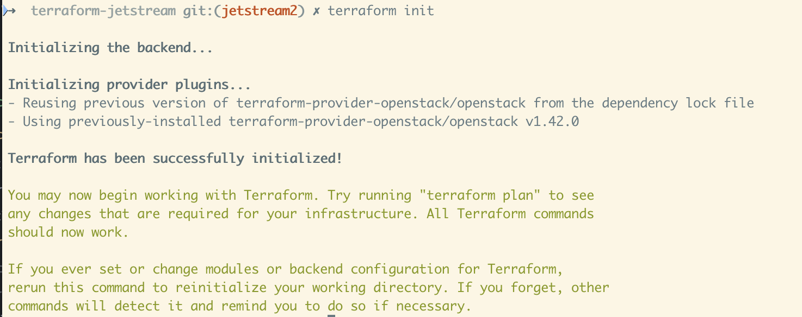
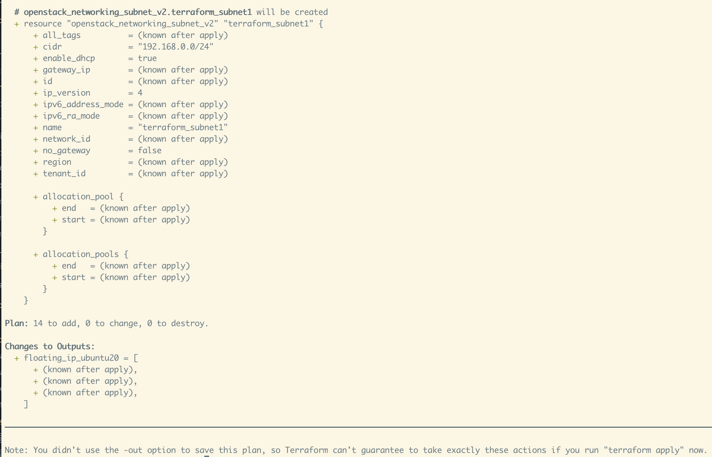
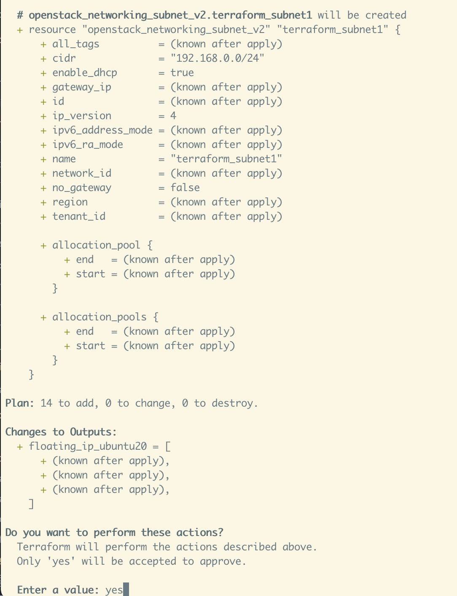

# Terraform on Jetstream2

Terraform is a open-source code as infrastructure tool that works with Jetstream2
and allows you to build and destroy infrastructure quickly and easily.

# Installing Terraform

The documentation to install terraform is located below. We have linked to the latest documentation
from the Terraform team.

[https://www.terraform.io/downloads](https://www.terraform.io/downloads)

# Cloning Jetstream Terraform git repo

## Getting started with git
If you are unfamiliar with git, the documentation is located here [git-scm](https://git-scm.com/book/en/v2)

## Git clone


# Running Terraform
Make sure that you have setup and downloaded your openrc file. [Setting up the openrc.sh for the Jetstream2 CLI](../ui/cli/openrc)

## Basic Operations


### Terraform Init

```terraform init```

[Terraform Init Documentation](https://www.terraform.io/cli/commands/init)

This is the first command that should be run after writing a new Terraform configuration or cloning an existing one. This command is used to initialize a working directory containing Terraform configuration files.

*Example*


### Terraform Plan

``` terraform plan```

[Terraform Plan Documentation](https://www.terraform.io/cli/commands/plan)

This command creates an execution plan which allows you to preview the changes that Terraform will change. The screenshot below is only a sample output of a plan.

*Example*



### Terraform Apply

``` terraform apply```

[Terraform Apply Documentation](https://www.terraform.io/cli/commands/apply)

This command makes changes based on what's defined in the terraform files and what's existing in your infrastructure already.

*Example*


# Writing YAML files and Validating YAML files
