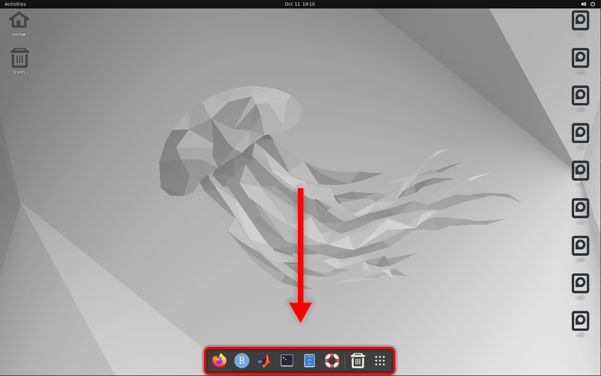
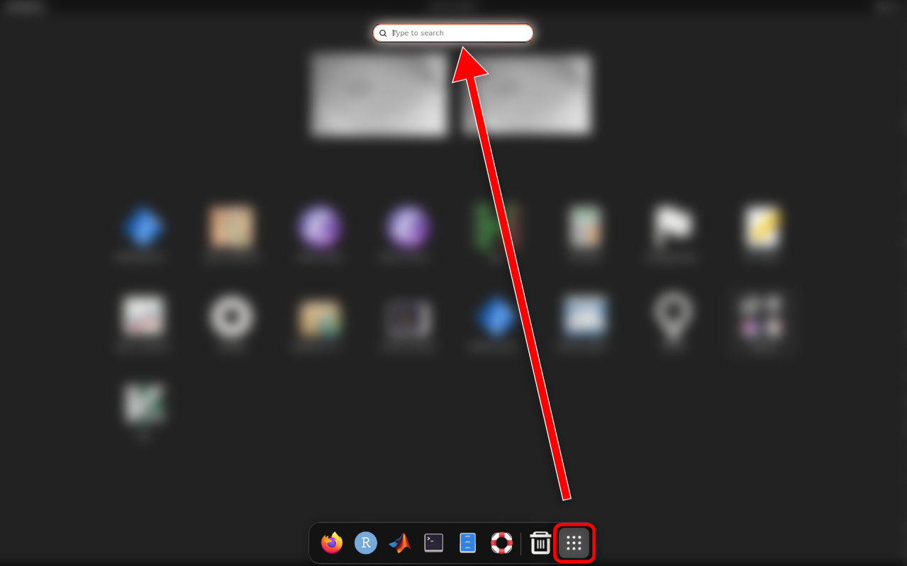
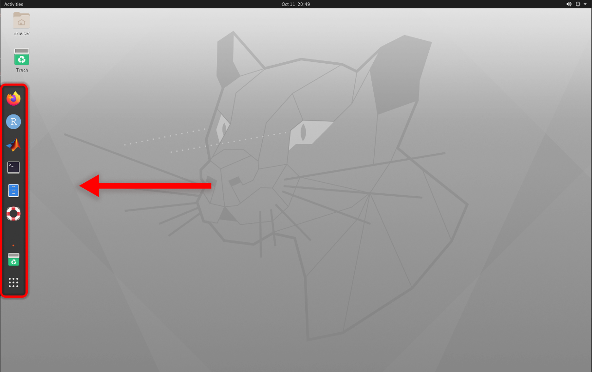
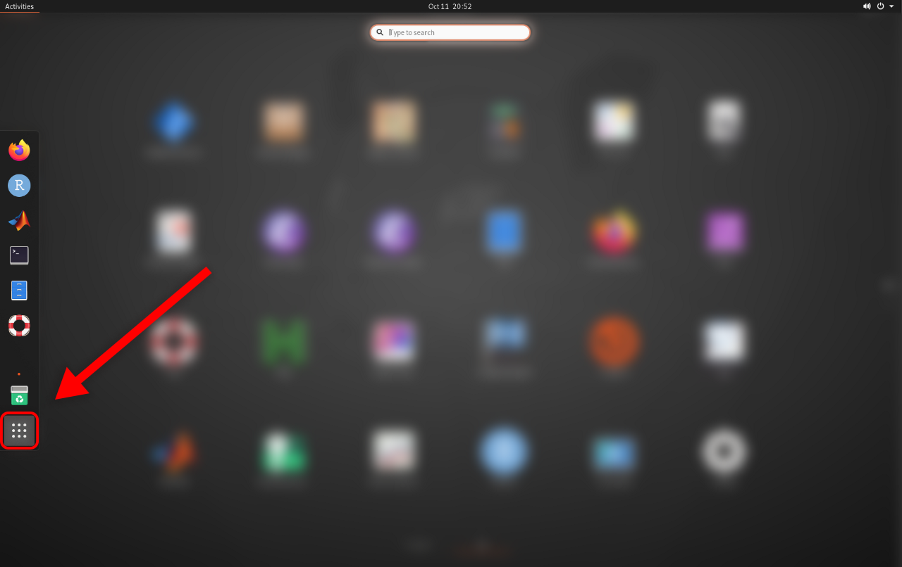
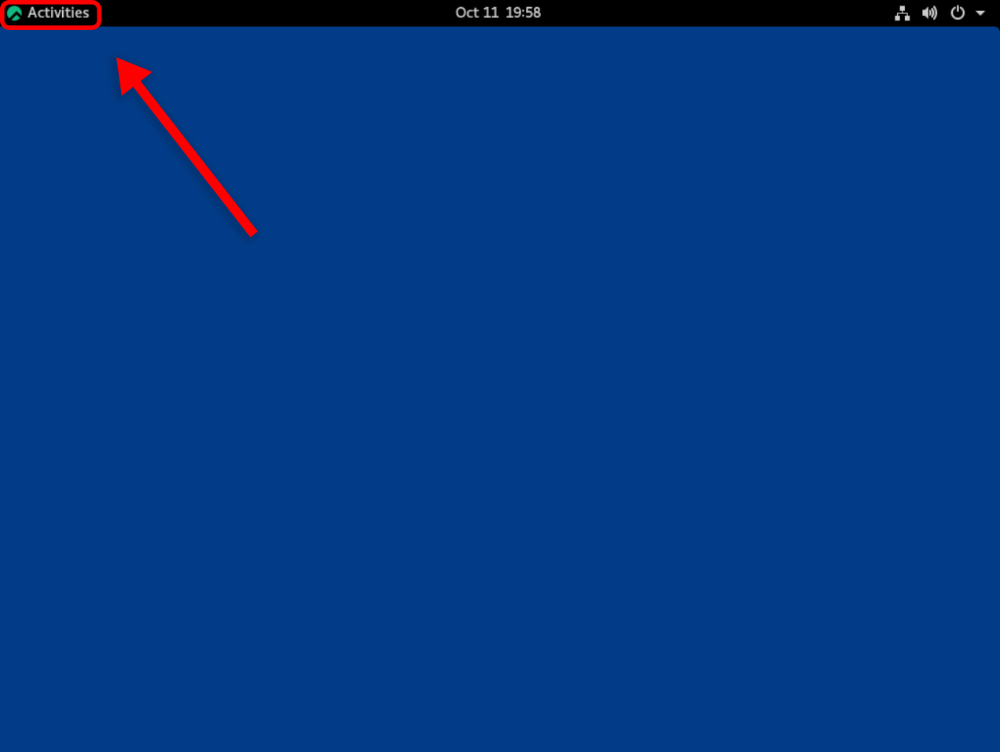

# Using the Jetstream2 Software Collection from the Web Desktop

The [Jetstream2 Software Collection](software.md) is automatically mounted to instances created from a [featured image](featured.md). If you are *not* using a featured image, it is possible to [manually add the software collection to your virtual machine](../usingsoftware-cli.md#manually-adding-the-software-collection-to-a-non-featured-virtual-machine); however, compatibility is not guaranteed.
{: .note}

Jetstream2 instances created through [Exosphere](../ui/exo/exo.md) may be [deployed with a Web Desktop](../ui/exo/create_instance.md#configure-instance). The Exosphere Web Desktop can be used to access the full Jetstream2 Software Collection, notably including graphical applications that cannot be used from the pure command-line (i.e. RStudio and MATLAB). 

## Navigating the Web Desktop

Though all featured images use the same desktop environment under the hood ([GNOME](https://www.gnome.org/)), the locations of applications and features may vary slightly. Desktop-compatible featured images from October 11, 2022 onward include easy-access application shortcuts for RStudio and MATLAB; however, all other software will need to be launched from the terminal (CLI). See *[Using the Jetstream2 Software Collection from the CLI](usingsoftware-cli.md)*.

Applications (including the terminal) can be found in the following respective locations:

### Ubuntu 22

In Ubuntu 22, application shortcuts can be found either on the favorites bar (bottom of the screen), or by searching the applications menu:

|           Favorites Bar                                                                              | Search Bar                                                                                           |
|------------------------------------------------------------------------------------------------------|------------------------------------------------------------------------------------------------------|
|  | |

### Ubuntu 20

Ubuntu 20 is similar to Ubuntu 22, but the favorites bar is located on the side. Shortcuts can be found on this favorites bar, in the applications list, or by searching.

| Favorites Bar                                                                                        | Show Applications                                                                                                        |
|------------------------------------------------------------------------------------------------------|--------------------------------------------------------------------------------------------------------------------------|
|  |  |

### Rocky Linux 8 and AlmaLinux 8

Unlike Ubuntu, Rocky and Alma do not immediately show a favorites bar on the desktop. First, click the "Activities" button in the top-left; from there, you can access the favorites bar, a list of all applications (the nine dots on the bottom of the favorites bar), and a search bar. 

| Rocky 8 "Activities" Menu (identical for Alma 8)                                                           | Favorites Bar, Application List, and Search Bar                                                                         |
|------------------------------------------------------------------------------------------------------------|-------------------------------------------------------------------------------------------------------------------------|
|  | |