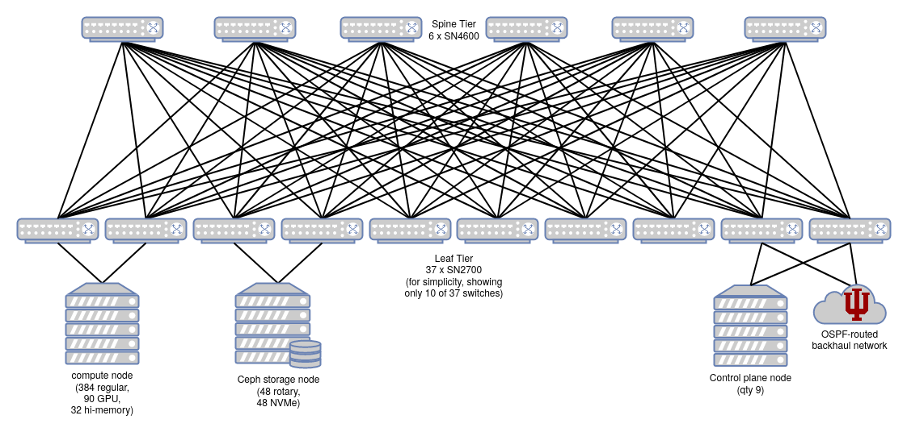
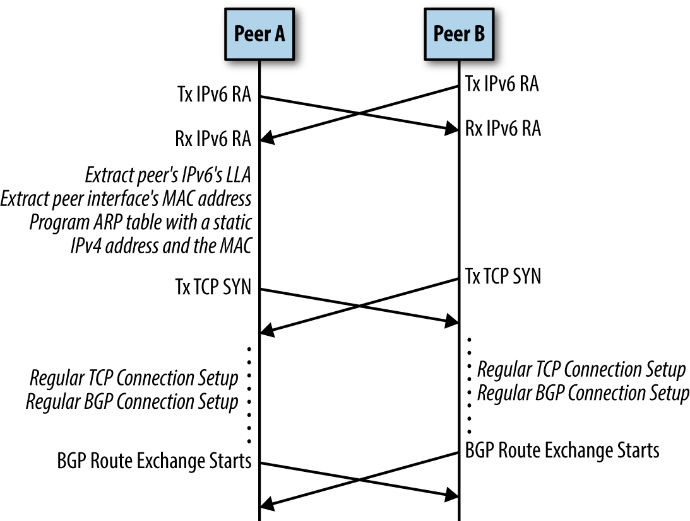

#Jetstream2 Network Configuration and Policies

### Summary of Network Configuration and Policies

#### Hardware Configuration:

The Jetstream2 primary cloud configuation features:

* 100 Gbps network connectivity from the compute hosts to the cloud's internal network infrastructure
* 4x40 Gbps uplinks from the cloud infrastructure to the data center infrastructure (2x100 planned)
* 100 Gbps connectivity from the site infrastructure to the Internet2 backbone
* 100 Gbps connectivity to the XSEDE research network via virtualized link
* Individual instances have full access to this infrastructure with no added speed limits.

*It is important to note that connections coming from commercial/commodity internet will likely not be as fast as those coming from Internet2 sites.*

#### Persistent IPs:

A key difference between Jetstream1 and Jetstream2 is that no special or additional access is required to get a persistent IP address. Some of the GUI interfaces like [Exosphere](../ui/exo/exo.md) and [Cacao](../ui/cacao/overview.md) release IPs by default when a VM is deleted. [Horizon](../ui/horizon/intro.md) and the Jetstream2 [CLI](../ui/cli/overview.md) require you to explicitly release the IP address.

We do ask that you release any unused IPs back to the public pool. There are a finite number of IPs available and allocations hoarding them may inadvertently cause issues for other Jetstream2 researchers.

The Jetstream administration team reserves the right to release any IP addresses not associated with a VM as needed.

#### Network Security Policies:

In general, Jetstream2 does not restrict inbound or outbound access to virtual machines. There are a handful of blocks at the instutional level that are outside of the control of the Jetstream2 staff. In general, though, the most common Unix service ports (eg. 22/ssh, 80/http, 443/https, etc) are not restricted in any way. Whether they are open by default will be dependent on which user interface you're launching your VM with.

Please refer to the [Security FAQ](../faq/security.md#what-is-the-default-security-profile-for-jetstream2-vms) for additional information.

-----

-----

-----

### In-depth exploration of Jetstream2 Networking

This section describes the network architecture of Jetstream2's primary cloud at Indiana University. Regional sites may be configured differently.

There are three kinds of networks used on Jetstream2.

- The **Cluster Network**, which carries all of the tenant/workload/data traffic. It _underlays_ the Neutron overlay networks for cloud workloads. It also carries all storage traffic and OpenStack control plane traffic.
- The **Neutron overlay networks**, an entirely software-defined (virtual) networking stack which runs on top of the cluster network.
- The **Management Network**, which is fully physically separate from the cluster network. It is used for managing hosts and their [iDRAC](https://en.wikipedia.org/wiki/Dell_DRAC){target=_blank}s.

This document primarily looks at the **Cluster Network** and may delve into the **Neutron overlay networks**. The Management Network is not in the scope of user-facing documentation.

## Cluster Network

[BGP in the Data Center](../attachments/bgp-in-the-data-center.pdf){target=_blank} is recommended reading. It provides background and orientation to Clos networks and BGP the way that it is used here. It is a short, accessible read for someone with general IT networking knowledge. For a quicker version, read chapters 1, 2, 4, and 6. Skim chapters 3 and 5.

The Jetstream2 network is a two-tier spine-and-leaf network in a [fat tree](https://en.wikipedia.org/wiki/Fat_tree){target=_blank} or [Clos](https://en.wikipedia.org/wiki/Clos_network){target=_blank} topology.

There are no inter-switch links (ISLs). Traffic that transits the network will generally traverse a leaf switch, a spine switch, and another leaf switch.

Two of the leaf switches connect the Cluster network to the campus WAN and internet. These happen to be the two leaf switches that the control plane nodes are also connected to.

### Physical Switches

Switches use the [Cumulus Linux](https://www.nvidia.com/en-us/networking/ethernet-switching/cumulus-linux/){target=_blank} operating system.

Switch types in the cluster network:

| **Model** | **Topology Layer** | **Switch Quantity** | **Port speed** | **Port Qty Per Switch** |
|-|-|-|-|-|
| Mellanox SN4600 | Spine | 6 | 100 GbE | 64 |
| Mellanox SN2700 | Leaf | 37 | 100 GbE | 32 |

### Dual-attached Servers

Each host (server) is _dual-attached_ to the Cluster network via two separate leaf switches, using two 100 GbE interfaces. Dual-attaching serves both purposes of redundancy and load-balancing (via equal-cost multipathing).

Redundancy is particularly important here, because many workloads that run on Jetstream2 will _not_ be 'cloud-native' or tolerant of partial-cluster network connectivity failure. Many users will hand-configure their analyses and services on a single instance (virtual machine) that runs on a single host in a single cabinet. Dual-attaching every physical server means that a single network switch failure will not cause a complete or prolonged outage for these non-cloud-native workloads. The physical compute node will quickly notice that one of its network links is offline, and re-route all network traffic to use the remaining functional link.

#### Server cross-wiring

Throughout the cluster, a given host may be variously connected to:

- 2 switches in the same cabinet, or
- 2 switches in an adjacent cabinet, or
- 1 switch in the same cabinet and 1 in an adjacent cabinet.

The benefit of this cross-wiring between cabinets is increased utilization of switch ports, and reduction of the number of switches needed. This is especially true in Jetstream2 because different types of hosts (e.g. compute, GPU, storage) are different physical sizes, i.e. different densities in a cabinet. The cost of cross-wiring is limited cabinet mobility, because hosts in one cabinet may have many connections to a switch in the next cabinet over, but cabinets are not expected to be moved over the lifetime of Jetstream2.

### Border Gateway Protocol

Jetstream2 uses [Border Gateway Protocol](https://en.wikipedia.org/wiki/Border_Gateway_Protocol){target=_blank} (BGP) to route and deliver packets across the entire cluster network. BGP was originally created to handle traffic between large network service providers (a.k.a. carriers), but is also adapted for use within data centers. In this application, BGP replaces use of [MLAG](https://en.wikipedia.org/wiki/Multi-chassis_link_aggregation_group){target=_blank} to route traffic over redundant physical paths between switches. Jetstream1 used MLAG, but Jetstream2 does not, for the following reasons:

- MLAG is fragile when making config changes
  - "Rigorous and conservative interface state management needed. Temporary loops or duplicates not acceptable" ([source](https://web.archive.org/web/20210924222054/https://people.netfilter.org/pablo/netdev0.1/slides/MLAG-on-Linux-Lessons-Learned.pdf){target=_blank})
- MLAG does not maximize use of aggregate throughout supported by redundant physical links.
- MLAG requires inter-switch links (ISLs), which would require many (about 96) additional links between switches, which would require more cabling and purchasing switches with more physical ports.

Use of BGP solves all of these drawbacks with MLAG. (See also [MLAG on Linux: Lessons Learned](https://web.archive.org/web/20210924222054/https://people.netfilter.org/pablo/netdev0.1/slides/MLAG-on-Linux-Lessons-Learned.pdf){target=_blank}. For a comparison of BGP and other internal routing protocols like Open Shortest Path First (OSPF), see pages 22 and 24 of [BGP in the Data Center](../attachments/bgp-in-the-data-center.pdf){target=_blank} (labeled as pages 14 and 16)).

Some more configuration details:

- On the Cluster network, peering between all nodes uses eBGP (external BGP), because each host and each leaf (but not spine) switch has its own individually-assigned private autonomous system number (ASN). iBGP (internal BGP) is not used.
- The spine switches all share a common ASN, 64512. This avoids path hunting problems as described in pages 26-29 of [BGP in the Data Center](../attachments/bgp-in-the-data-center.pdf){target=_blank} (labeled as pages 18-21).
- [Equal-cost multipathing](https://en.wikipedia.org/wiki/Equal-cost_multi-path_routing){target=_blank} allows packet forwarding to a single destination to be load-balanced across multiple network paths.

#### BGP Unnumbered

In the cluster network, there is no network _bridging_ or explicitly-defined shared subnets between connected switches (or between switches and hosts). There is only _routing_ of packets between hosts. BGP requires underlying TCP/IP connectivity in order to create a connection, so how can that happen if we have no explicitly-defined subnets or bridges?

In very short, each physical 100 GbE interface on each node (host or switch) has only a [link-local IPv6 address](https://en.wikipedia.org/wiki/Link-local_address#IPv6){target=_blank} assigned. IPv6 Router Advertisement (RA) is a link-level protocol that periodically announces an interface's IPv6 addresses, including the link-local address. This is how each node identifies the IP of its peer. RFC 5549 allows a system to advertise IPv4 routes, and route IPv4 packets, over a pure IPv6 network. It also adds an "extended nexthop" capability to BGP, which negotiates use of RFC 5549 over a BGP peering session.

This strategy is described in greater detail in chapter 4 of [BGP in the Data Center](../attachments/bgp-in-the-data-center.pdf){target=_blank}. The result is that there is no need to define a shared subnet between any nodes. There is also no need to explicitly define neighbor-specific information in a node's configuration. Two peers connected with a network cable will discover each others' link-local addresses, exchange IPv6 route advertisements, and initiate a BGP route exchange.

#### Routing on the Host

In traditional enterprise networking, packet routing (at layer 3 in the OSI model) is generally performed _off the host_, i.e., by router hardware that is physically separate from servers running the workloads. Sometimes there is purpose-dedicated router hardware, and sometimes routing is a role performed by the ethernet switches. In either case, servers do not make most packet routing decisions. Servers are _bridged_ to routers at layer 2, on a common subnetwork. Servers determine where to send packets using ARP (Address Resolution Protocol). **This is not how the Jetstream2 Cluster network operates.**

Instead, the BGP routing fabric is extended all the way to each server. Each host has its own BGP autonomous system number (ASN), and runs the same FRRouting software as the switches. The host's primary IPv4 address (in private, RFC 1918 space) will appear on the loopback interface, and it is configured as a `/32` in CIDR notation -- as its very own single-IP subnetwork, not bridged anywhere else!

A server advertises BGP routes for its own internal IPv4 address. These routes are advertised to both switches that the server is attached to, via IPv6 link-local connectivity. This overall strategy is called "Routing on the Host", and it is described in chapter 6 of [BGP in the Data Center](../attachments/bgp-in-the-data-center.pdf){target=_blank}.

Again, in the cluster network there is no bridging between physical nodes, only routing.

Some more background reading (if you don't like the book):
- [Linux Routing On The Host With FRR](https://codingpackets.com/blog/linux-routing-on-the-host-with-frr/){target=_blank} ([archived version](https://web.archive.org/web/20210124124824/https://codingpackets.com/blog/linux-routing-on-the-host-with-frr/){target=_blank})
- [Independence from L2 Data Centers](https://web.archive.org/web/20210305063734/https://cumulusnetworks.com/blog/independence-l2-data-centers/){target=_blank}
- [Border Gateway Protocol](https://docs.nvidia.com/networking-ethernet-software/cumulus-linux-44/Layer-3/Border-Gateway-Protocol-BGP/){target=_blank} ([archived version](https://web.archive.org/web/20210924225434/https://docs.nvidia.com/networking-ethernet-software/cumulus-linux-43/Layer-3/Border-Gateway-Protocol-BGP/){target=_blank})

### Conclusion

All of this BGP unnumbered architecture supports the 'Abstraction layer' of one or more IPv4 addresses on each host, and the ability to route packets from any host to any other host by its IPv4 address. At this level of abstraction and above, there is no concern with (or visibility of) the BGP routing layer or link-local IPv6 addresses. The Neutron overlay networks do not see it, or know about its complexity.

---

Areas of future discussion:

## Neutron Overlay Networks

TODO

### Layer 2 (Data Link)

VXLAN / Open vSwitch / Linux Bridge?

### Layer 3 (Network)

Neutron Distributed Virtual Routing (DVR)

Typically with DVR, egress traffic leaves a compute node directly to the WAN, while ingress traffic passes through a network node.

See also:
- <https://docs.openstack.org/neutron/latest/admin/config-service-subnets.html>
