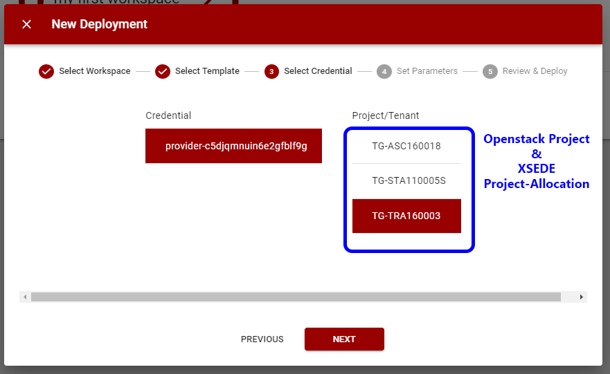

{ width=128px }[Cacao Overview](overview.md) &gg; Choosing your Allocation

# Choosing your Allocation

Your account should have an Openstack project for every active XSEDE project-allocation. Jetstream2 uses the Openstack project to launch and recognize utilization against your XSEDE project-allocation. 

Within Cacao, you can assign the XSEDE project-allocation in the deployment wizard when you select the appropriate credentials. Note, a Jetstream2 application credential will automatically assign the Openstack project, which is tied to the application credential. Jetstream password credentials allow you to change the XSEDE project-allocation.

{ width=80% }

Now that you know how to choose your allocation, you can learn more about [credentials](credentials.md) and [deployments](deployments.md).