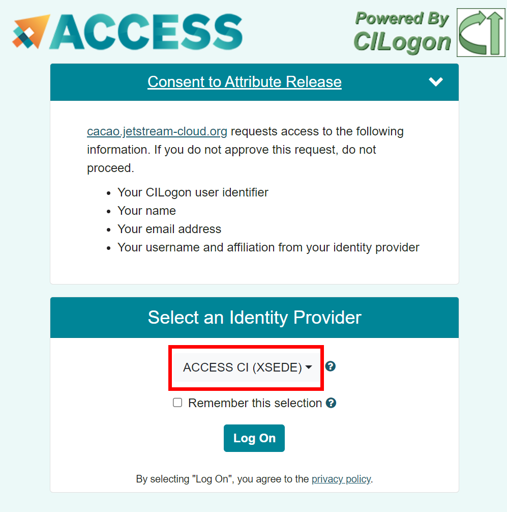
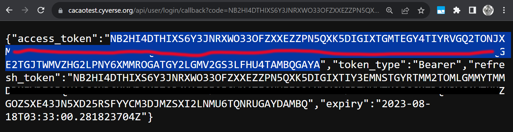
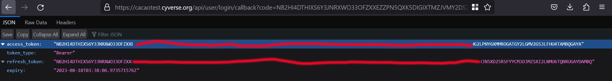

{ width=128px }[CACAO Overview](overview.md) &gg; Using the CACAO CLI

# CACAO Command-Line Interface

The CACAO Command-Line Interface (CLI) allows command-line users to interact with CACAO. The CLI is a Go program that can be installed on any system.

## Installation

1. The CACAO CLI is a single binary that can be installed on any system. The most recent cli binaries can be downloaded from [the CACAO packages page on Gitlab](https://gitlab.com/cyverse/cacao/-/packages) or you can download from here:

- [CACAO Mac (Darwin) ARM64](https://gitlab.com/cyverse/cacao/-/package_files/101908036/download)
- [CACAO Mac (Darwin) AMD64](https://gitlab.com/cyverse/cacao/-/package_files/101907995/download)
- [CACAO Windows AMD64](https://gitlab.com/cyverse/cacao/-/package_files/101907940/download)
- [CACAO Linux ARM64](https://gitlab.com/cyverse/cacao/-/package_files/101907892/download)
- [CACAO Linux AMD64](https://gitlab.com/cyverse/cacao/-/package_files/101907877/download)

2. If necessary, rename the file to `cacao.zip` and unzip the file. After unzipping, binary will be named `cacao_<os>_<architecture>` e.g. `cacao_darwin_arm64` or `cacao_linux_amd64`.

3. Optional, rename your binary to `cacao` and move into your path, such as `/usr/local/bin`. 

For Linux users, this would be an example of the installation process described above:

```bash
wget -O cacao.zip  https://gitlab.com/cyverse/cacao/-/package_files/101907877/download
unzip cacao.zip
mv cacao_linux_amd64 /usr/local/bin/cacao
```

## Login with the CACAO CLI

There are currently two approaches to logging in with the CACAO CLI.

### Login Option 1: Login with CIlogin federated identity

This method integrates with CILogin and requires a few steps.

1. `cacao login --browser`

**NOTE: What to do if you encounter a login issue?**
> Sometimes login using the command line will fail -- a typo happens, a copy-n-paste of a token happens, using the wrong api url happens, etc -- and you need to reset your login. To reset your login, you can use the following command:
> `cacao logout`

```bash
Please provide address of Cacao API.
Format Should be: http://<hostname>:<port>        or    <hostname>:<port> 
(Developers: this should match the value of API_DOMAIN in install/config.yaml followed by "/api", e.g. ca.cyverse.local/api)
Cacao API address (http://ca.cyverse.local/api): https://cacao.jetstream-cloud.org/api
```

2. Enter the CACAO API url: `https://cacao.jetstream-cloud.org/api`

```bash
Cacao API address (http://ca.cyverse.local/api): https://cacao.jetstream-cloud.org/api
Please go to this URL in the browser: https://cacao.jetstream-cloud.org/api/user/login

After login, you should get a JSON response, the auth token could be the value of following properties:
- "IDToken" or "id_token" if keycloak
- "access_token" if other auth provider

Enter the auth token you get from browser: 
```
3. In your browser open the following URL (this is also echoed in the terminal, line #5): https://cacao.jetstream-cloud.org/api/user/login

**WARNING!**
> It is recommended that you use the "ACCESS CI (XSEDE)" identity provider when you login, especially if you encounter any issues logging in. After creating your ACCESS CI identity, you should be able to login with [other linked identities](https://operations.access-ci.org/identity/id-linking).

{ width="60%" }

4. You will need to grab the the "access_token" that is returned from the browser and paste the following text into the terminal: "Bearer" followed by a space and then the access token. For example, if the access_token were GOOSE, the the string you enter will be: `Bearer GOOSE`

**Tip**
> - Do not include the quotes around the token. 
>- `Bearer` is case sensitive.
> - There is one space between Bearer and the token.

Below are screenshots of what you might expect to see from Chrome and Firefox.

Chrome:

{ width="75%" }

Firefox:



After pasting the "Bearer " + access_token, you should return to the shell prompt.

```bash
Enter the auth token you get from browser: Bearer NB2HI4DTHIXASDFUINASDKLFASDHFKASDFJASDFA23FNYTHI4Z5GE3DSMRTGMYDGNJWHE3TIJTWMVZHG2LPNY6XMMROGATGY2LGMV2GS3LFHU4TAMBQGAYA
$ 
```

5. To test a successful login, you can execute a cacao command, such as: `cacao provider get`


### Login Option 2: Login with CACAO API token using cacao cli

1. While logged in with a Bearer token as above, use the cacao cli to create a cacao API token:

```bash
$ cacao token create -n token-name -t personal -e 2024-01-01T00:00:00Z -s api
```
Expiration (-e) is expected to be an [ISO 8601](https://en.wikipedia.org/wiki/ISO_8601) datetime string. Use a reasonable expiration date, up to 1 year into the future.

Optionally set a start date with -s.

After entering the create command, the token you created will be displayed:

```bash
{
    "id": "cptoken_xxxxxxxxxxxxxxxxxxxxxxxxxxxxxxxxxxxxxxxxxxxxxxxxxxxxxxxxxxxxxxxxxxxxxxxxxxxxxxxxxxxxxxxxxxxxxxxxxxxxxxxxxxxxxxxxxxxxxxxxxxxxxxxxxxxxxxxxx_clbqcdxxxxxxxxxxxxx",
    "tid": "tid-clbqcdxxxxxxxxxxx",
    "timestamp": "2023-11-17T17:43:19.319789233Z"
}
```

**Be sure to save the token "id" in safe place! Treat it like a password!**  This is what you use to login and access the token. The access string is shown only once after creating the token.


2. Log out of cacao via `cacao logout` and log back in via `cacao login --browser`
3. Enter the CACAO API url: `https://cacao.jetstream-cloud.org/api`
4. Next, enter the CACAO API token you created earlier:

```bash
Cacao API address (http://ca.cyverse.local/api): https://cacao.jetstream-cloud.org/api
Please go to this URL in the browser: https://cacao.jetstream-cloud.org/api/user/login

After login, you should get a JSON response, the auth token could be the value of following properties:
- "IDToken" or "id_token" if keycloak
- "access_token" if other auth provider

Enter the auth token you get from browser: cptoken_xxxxxxxxxxxxxxxxxxxxxxxxxxxxxxxxxxxxxxxxxxxxxxxxxxxxxxxxxxxxxxxxxxxxxxxxxxxxxxxxxxxxxxxxxxxxxxxxxxxxxxxxxxxxxxxxxxxxxxxxxxxxxxxxxxxxxxxxx_clbqcdxxxxxxxxxxxxx
```
You are now logged in with a CACAO API token.


### Login Option 2: Login with CACAO API token (UI coming soon!)


This method is significantly easier than the CILogin method, where you can simply create a CACAO API Token using the CACAO user interface and use that token with the CLI. This option will be available soon.
