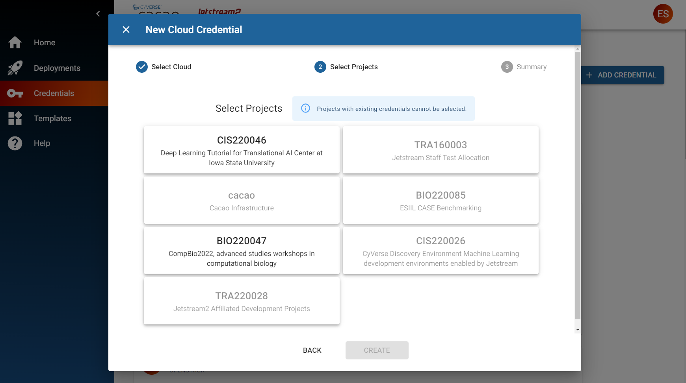
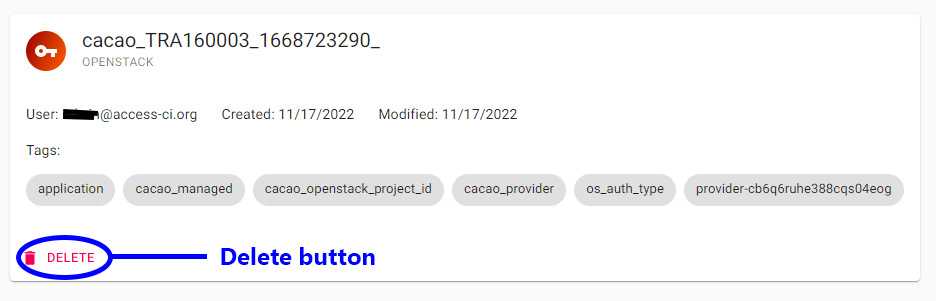
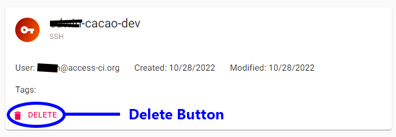

{ width=128px }[Cacao Overview](overview.md) &gg; Credentials

# Credentials

CACAO allows you to manage various types of cloud and access credentials. Some credentials are required before using a cloud, such as the Jetstream2 Application Credential. Other credentials, like the ssh public key, are injected into the VM for access or convenience.

Below are instructions for Jetstream2

# Cloud Credential (Jetstream2)

A cloud credential allow to access a cloud provider, such as Jetstream2 or AWS.

## Adding a cloud credential for an ACCESS allocation

Jetstream2 resources are generally associated with an ACCESS allocation. To begin creating resources in Jetstream2, you will need to add or import an OpenStack Application Credentials into CACAO.

!!! cacao-steps ""
    1. Click on the Credentials menu
    2. Click on Add Credential button
    3. Select Cloud Credential
    4. Select Jetstream 2
    5. Click Next
    6. Select the ACCESS allocation that you wish to import into CACAO (if you belong to multiple allocations, you can select multiple allocations)
    8. Click on the Add button

    { width="75%" }

## Deleting a cloud credential

!!! cacao-steps ""
    1. Click on the Credentials menu
    2. Locate the OpenStack credential for the Jetstream2 allocation you wish to delete
    8. Click on the Delete button

    { width="75%" }

# SSH Public Key

SSH Public Keys are used to login to virtual machines (sometimes called 'servers' or 'instances') after they are launched.

**_Note_:** &#9432; Currently, all ssh public keys added into the CACAO credentials will be added to every instance in Jetstream2. This will change in a future release.

**_Warning_:** &#9888; If you do not add an ssh public key, then you will only be able to access instances using web shell or web desktop.

## Adding an SSH Public Key

!!! cacao-steps ""
    1. Click on the Credentials menu
    2. Click on the Add Credential button
    3. Select Public SSH Key
    4. Enter a name for your public ssh key
    5. Paste in your public ssh key
    6. Click on the Add button

    { width="75%" }

## Deleting an SSH Public Key

!!! cacao-steps ""
    1. Click on the Credentials menu
    2. Locate the ssh public key you wish to delete
    8. Click on the Delete button

    { width="75%" }