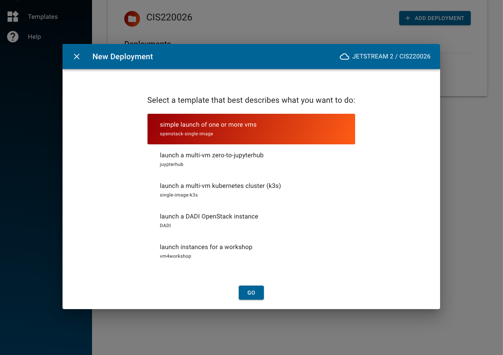
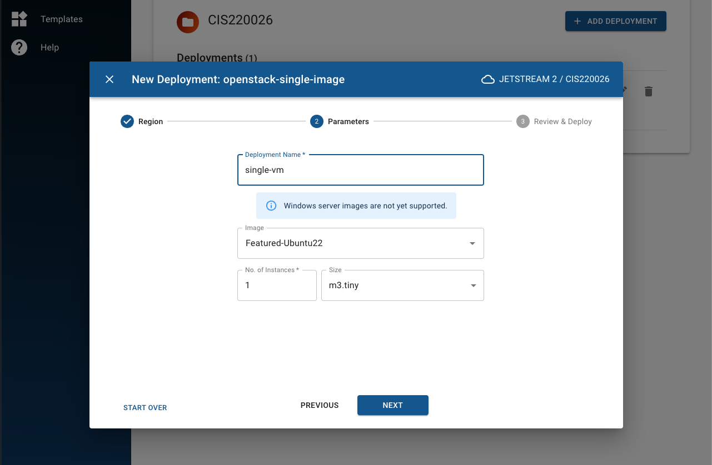
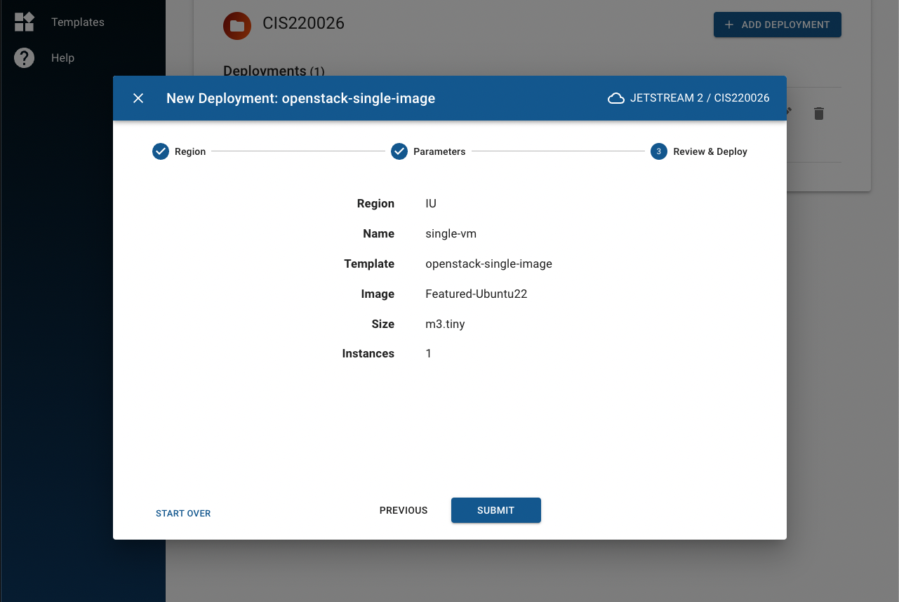
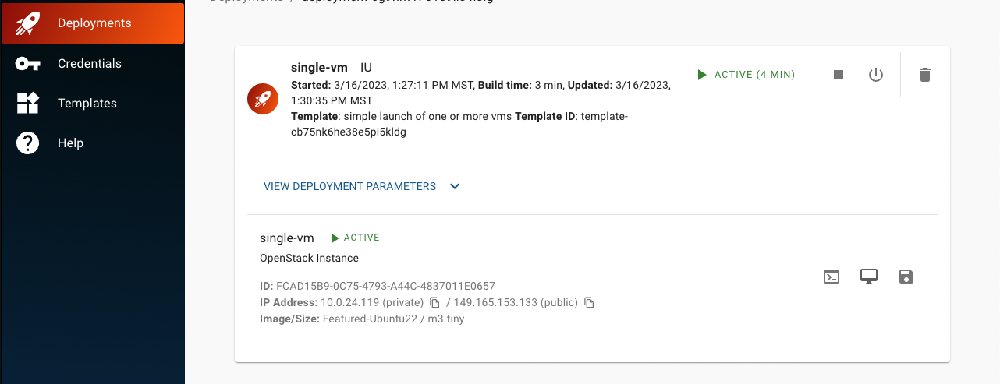

# Deploying Single/Multiple VMs

From the deployment screen, select **simple launch of one or more vms**

This will open a small window, which will ask you which region you'd like to deploy onto (more regions are to be deployed in the future, for now 'IU' is the only option). Clicking **Next** will open the Parameters window. Give the deployment a descriptive name, and select the image you'd like to deply from. In this example, we choose the base **Featured-Ubuntu22** image. You can also select the amount of instances you want to create (in the example, we only create one), and the [size](https://docs.jetstream-cloud.org/general/vmsizes/) of deployment.

Clicking next, will open the summary window prior to launch. To deploy, click **Submit**.

The VM should be successfully launched after a few minutes of building. You can access the VM by either:

1. clicking on the small Console button;
2. clicking on the PC button;
3. Through `ssh` (assuming you already have added your credentials)

