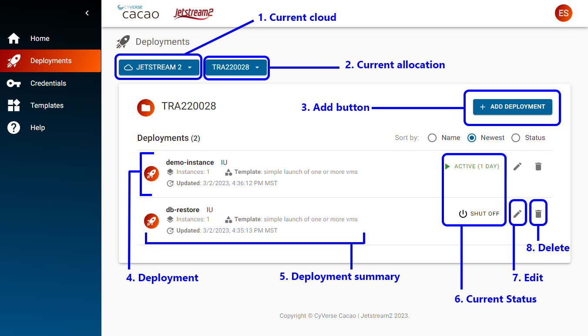
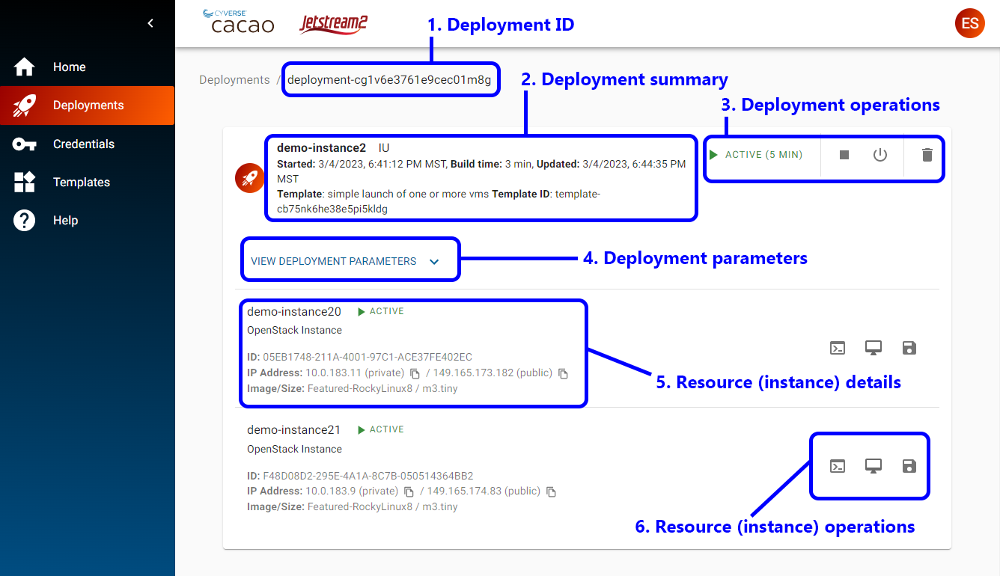

{ width=128px }[Cacao Overview](overview.md) &gg; Deployments

[TOC]

# Deployments

A deployment is a collection of one or more resources, such as instances and storage, created in a cloud. In a simple deployment, there might be one instance; in a more complex deployment example, there might be multiple instances, each with their own volumes, and a common shared storage.

Unlike other cloud user interfaces, where cloud resources are generally created and deleted individually, CACAO provides the means to create a collection of resources through the use of orchestration templates. Currently, Hashicorp Terraform templates, and other templates that can be executed using the local-exec provisioner including Ansible, are only supported in CACAO. Future releases of CACAO will support other templates, including Kubernetes-native and Nextflow templates.

## Deployments View

{ width="95%" }

The above screenshot shows the view of the deployments within CACAO. From this screen, you can create new deployments, change your allocation, view your deployments and their statuses, and perform select actions. Each element in this screen is described in detail below.

### 1. Current cloud

This select box shows the current cloud in use for new deployments or existing deployments being shown on the screen. Currently, Jetstream2 is the only cloud.

### 2. Current allocation

This select box shows the current ACCESS allocation (or project) in use for new deployments or existing deployments being show on the screen. If you have more than one deployment, you can change your allocation (or project) using this select box.

### 3. Add button

This button will start the deployment wizard to create a new deployment in this cloud and allocation.

### 4. Deployment 

Each deployment will have an entry in this view. You can click on a deployment to view its details. For more information, see [Deployment Details](#deployment-details)

### 5. Deployment summary

Each deployment will have a deployment summary, containing the following information:

* deployment name
* the region within the cloud
* number of instances
* the template used for the deployment
* the date and time the deployment was updated

### 6. Current Status

Each deployment will have a status. A status of "active" indicates the deployment is currently running.

### 7. Edit (Deployment)

After a deployment is active, you can edit some of the configuration. Examples of parameters you can edit are changing the name of the deployment and increasing the number of instances.

### 8. Delete (Deployment)

The Delete button for a deployment will delete all the resources, including instances and any storage, that were created as part of the deployment.

## Deployment Details

{ width="95%" }

The above screenshop shows the details of a deployment, which can contain one or more resources. From this screen, you can manage or view detailed information of a deployment including, the parameters used to create the deployment, perform deployment operations, or access the resources of a deployment. Each element of this view is described below.

### 1. Deployment ID

Every deployment has a unique ID in CACAO. This can be used if you need to contact support.

### 2. Deployment summary

The deployment summary on this screen is similar to the information contained in the deployments view. Additional information in this summar include start time, build time, and the template id for the deployment.

### 3. Deployment operations

You can start, shelve, stop, and remove (delete) a deployment from these buttons. These operations are similar to those that you can perform in other user interfaces, but operate on all instances in a deployment.

### 4. Deployment parameters

Expanding this section will expose the parameters used to configure the deployment.

### 5. Resource (instance) details

Every resource created as part of the deployment will have summary information, which may differ on the type of resources. Instances will have the following information:

* name
* state
* resource type
* ID (unique to cacao)
* private ip address
* public ip address (openstack floating ip)
* image
* flavor

### 6. Resource (instance) operations

If a resource has additional operations, they will be available in this section. Instances will have the following operations:

* web shell
* web desktop
* image (not currently available)