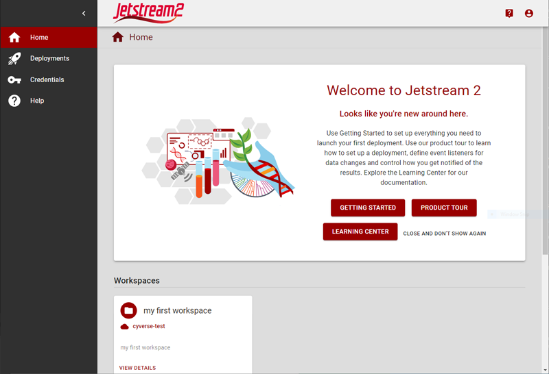

{ width=128px }[Cacao Overview](overview.md) &gg; Cacao UI basics

# Cacao UI basics

Welcome to CACAO, a multi-cloud orchestration service. CACAO helps transform research and education in a multi-cloud world. This guide will cover how to navigate the user interface of CACAO.

## Sidebar

The sidebar is the main navigation for the CACAO user interface.

### Home

The Home view provides a dashboard for your account, including a summary of your providers, allocation, and resources used

### Deployments

Deployments displays your workspaces and deployemnts.

### Credentials

Credentials provides access to your the various credentials used to access clouds and resources, including ssh key and openstack credentials

### Storage (still baking)

Storage displays your storage resources

### Providers (still baking)

Providers displays details about your clouds.

### Templates (still baking)

Templates provides advanced users access to import or share templates they create.

## Help

Help provides access to help resources

## Your Account

Your Account menu shows your account information and access to your settings and preferences.

