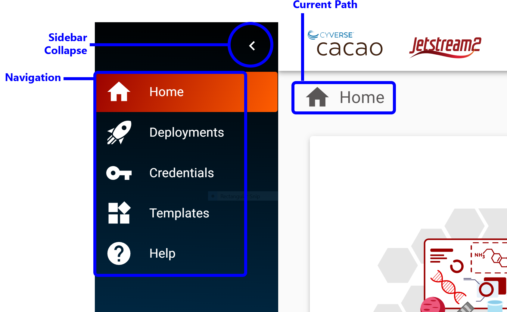
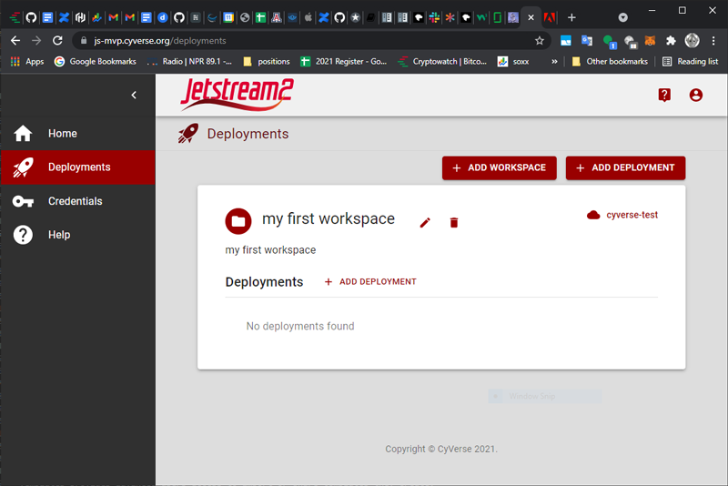
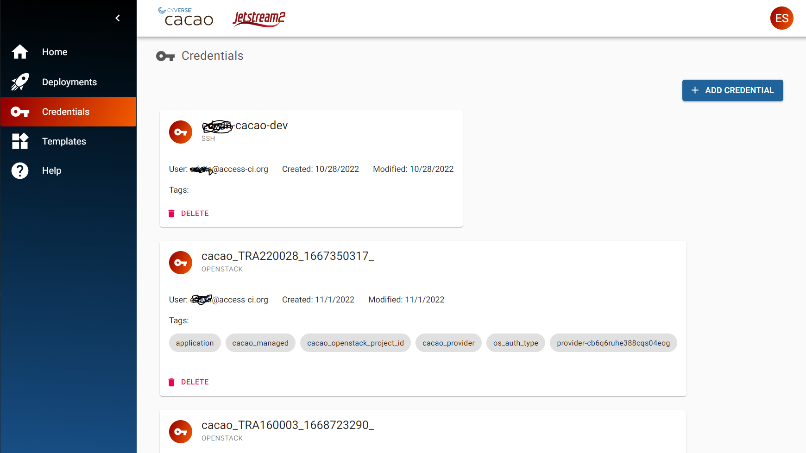

{ width=128px }[Cacao Overview](overview.md) &gg; CACAO UI basics

# CACAO UI basics

Welcome to CACAO, a multi-cloud orchestration service. CACAO helps transform research and education in a multi-cloud world. This guide will cover how to navigate the user interface of CACAO.

## Sidebar

The sidebar is the main navigation for the CACAO user interface.

### Home

The Home view provides a dashboard for your account, including a summary of your providers, allocation, and resources used

### Deployments

Deployments displays your workspaces and deployemnts.

### Credentials

Credentials provides access to your the various credentials used to access clouds and resources, including ssh key and openstack credentials

### Templates

Templates provides information about templates that have been imported in the system and that are available for you to create deployments onto Jetstream2. You can only see templates that are available to you, whether public or private templates imported by you.

## Help

Help provides access to help resources

## Your Account

Your Account menu shows your account information and access to your settings and preferences.

