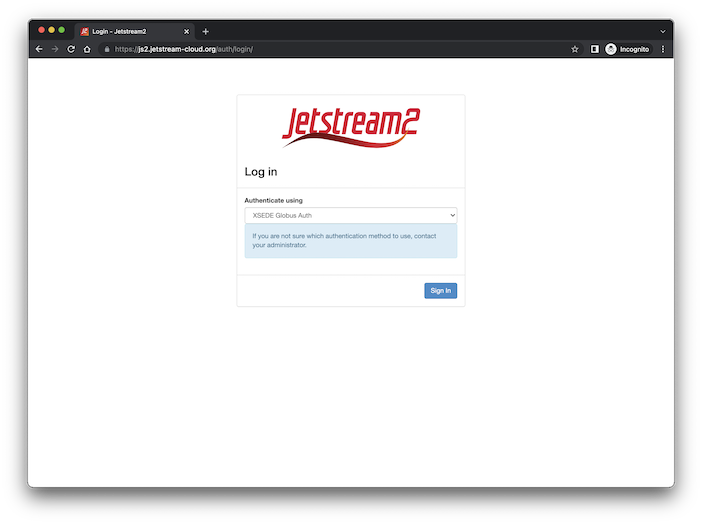
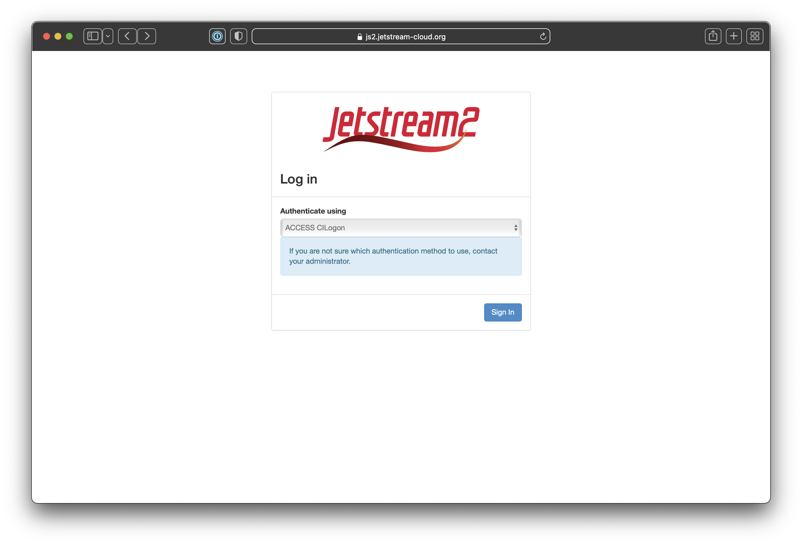
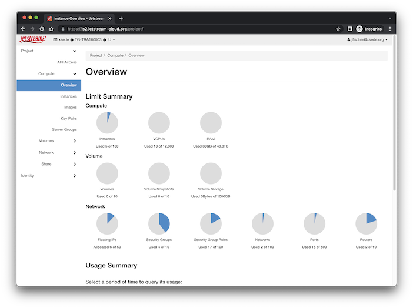
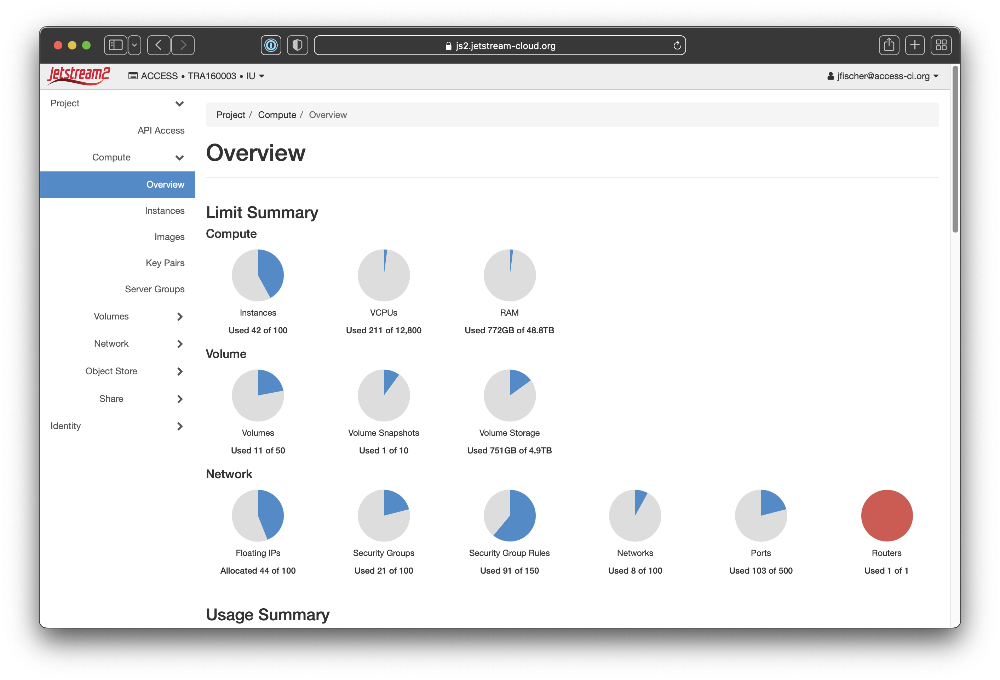

# Setting up openrc.sh for the Jetstream2 Command Line Interface

### New openrc format for Jetstream2 CLI!

One of the key changes to using Jetstream2's command line interface (CLI) is that it uses XSEDE credentials for authentication. To do that, you have to create an application credential via the [Horizon](../horizon/intro.md) interface. This page will walk you through that process.

### Openrc files are allocation-specific

Each allocation you wish to use from the command line will need its own application credential and openrc file.

### Using the Horizon dashboard to generate openrc.sh

<table>
  <tr>
    <th>Action</th>
    <th>Screenshot</th>
  </tr>
  <tr>
    <td>Navigate to [https://js2.jetstream-cloud.org/](https://js2.jetstream-cloud.org/){target=_blank}</td>
    <td>
    </td>
  </tr>
  <tr>
    <td>You should be at the Horizon Dashboard home now.</td>
    <td> 
    </td>
  </tr>
</table>

         1. Login to Horizon:  
>IU: https://iu.jetstream-cloud.org/dashboard 
>Domain: IU
>User Name: *your TACC username*
>Password: *your TACC password*

2. If you are on more than one allocation, select the project (XSEDE allocation) by clicking where it says "tacc · TG-xxxxxxxx · RegionOne" and choose the appropriate allocation.
3. Click on your username in the upper right hand corner
4. Click on Download OpenStack RC File v3 . The password is not stored in the script. This openrc.sh file will prompt for a password when sourced. 
 
***Note: ***To select an active project prior to generating openrc.sh, click on Identity (left hand side) to see a list of your projects.
