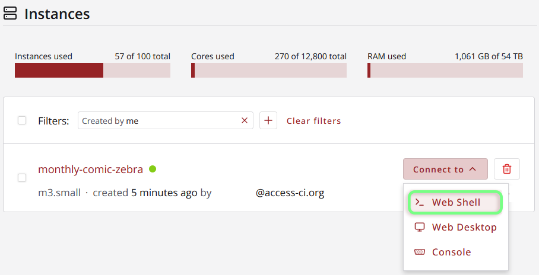
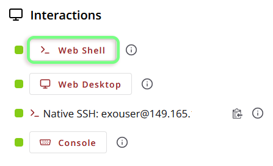

# Accessing an Instance with Exosphere

Exosphere provides a variety of different methods for interacting with your instances, depending on the options selected during creation.

## The exouser Profile

Instances launched with Exosphere will be created with a user `exouser`. By default, `exouser` has `sudo` privilege, and any web shells/desktops launched from Exosphere will be signed in as `exouser`. 

## Web Shell (Guacamole)

By default, Exosphere configures all new instances with an easy-access web shell via [Guacamole](https://guacamole.apache.org/). The web shell can be accessed either from the Exosphere *Instances* page ("Connect to" → "Web Shell") or from the *Interactions* section of your instance's main page. 

| "Instances" Page | Individual Instance Page |
|---------|---------|
|  | |

Opening the 