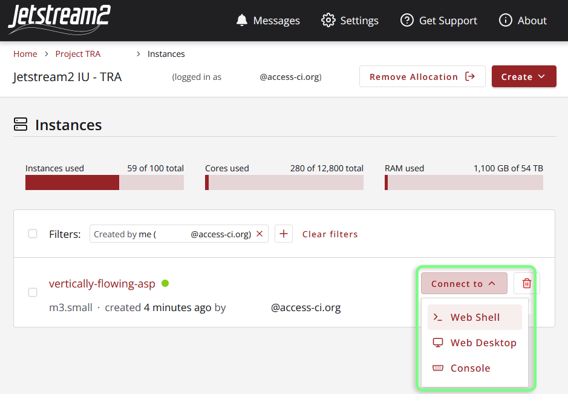
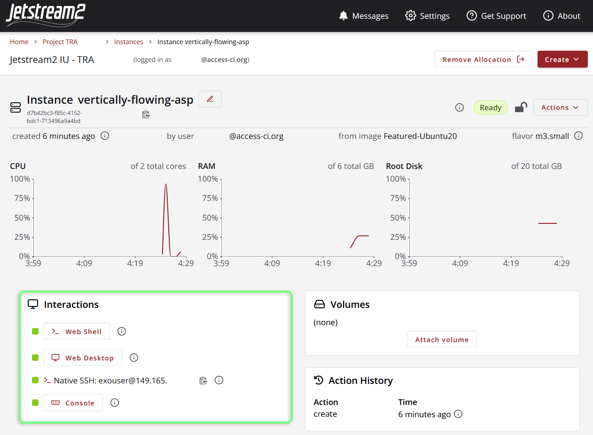

# The exouser Profile & Passphrase

Instances launched with Exosphere will be created with a user `exouser`. By default, `exouser` has `sudo` privilege, and any web shells/desktops launched from Exosphere will be signed in with this account. Should you ever need the *initial* password/passphrase created for `exouser`, it can be found on the individual Exosphere page for your instance under "Credentials."

# Accessing an Instance through Exosphere

Exosphere provides a variety of different methods for interacting with your instances, depending on the options selected during creation. These options include the web shell, web desktop, and console, all of which can be accessed either from the Exosphere *Instances* page (with the "Connect to" dropdown) or from the *Interactions* section of your instance's main page. 

Remember that the web shell and web desktop will not be available if you have chosen not to assign a public IP address to your instance!
{: .note}

| "Instances" Page | Individual Instance Page |
|---------|---------|
|  | |

## Web Shell (Guacamole)

By default, Exosphere configures all new instances with an easy-access web shell via [Guacamole](https://guacamole.apache.org/). This command-line interface signs in as `exouser`, and thus has `sudo` access. 

***Tip***: From the web shell, you can open/close a menu overlay with `ctrl`+`alt`+`shift`. This menu supports directly uploading files to your instance, as well as sharing clipboard data.
{: .note}

## Web Desktop (Guacamole)

If an instance was [configured with Web Desktop](../create_instance/#configure-instance) enabled, Exosphere will provide an interactive [GNOME](https://www.gnome.org/) desktop environment for you to work in. Like the web shell, this is powered by [Guacamole](https://guacamole.apache.org/) and signs in as `exouser`. 

## Console

The Exosphere console is usually only used in rare circumstances, and is more akin to plugging a monitor, keyboard, and mouse into the machine than accessing it via the web shell. When using the console, you will not be signed into the machine automatically, so you will likely need to reference the `exouser` passphrase (see above).

# Accessing an Instance with Native SSH