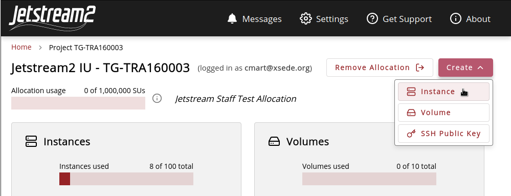
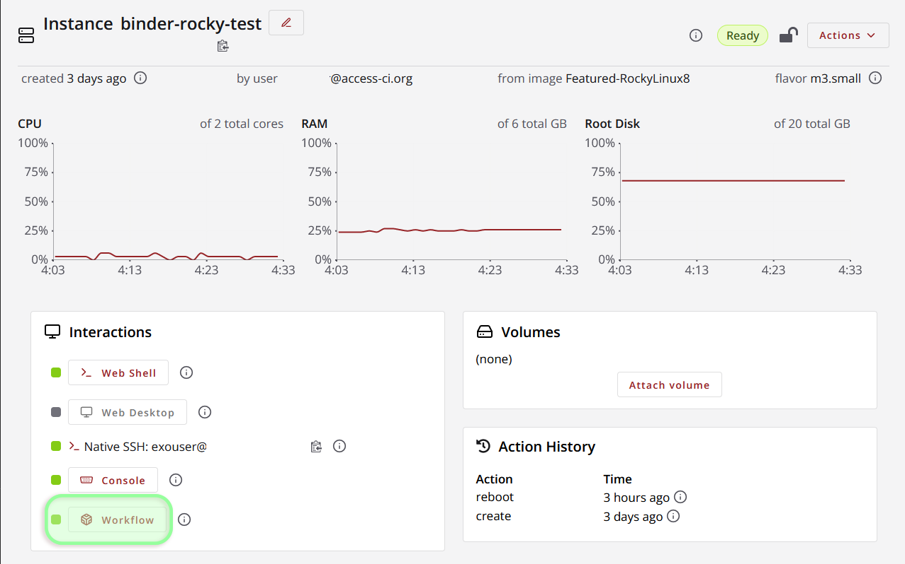

# Binder Workflows in Exosphere

!!! warning "About experimental features"

    Exosphere's Binder-related functionality is an experimental feature. Developing it further may not be a current priority; users are still encouraged to [report any bugs they encounter](https://jetstream2.exosphere.app/exosphere/getsupport){target=_blank}, but they may not receive a quick resolution.

## About Binder & BinderHub
[Binder](https://jupyter.org/binder){target=_blank} is a project maintained by Project Jupyter that allows for the deployment and sharing of computing environments with a single link. It is built on an open-source software stack that converts a [Reproducible Execution Environment Specification](https://repo2docker.readthedocs.io/en/latest/specification.html){target=_blank} (stored as a git repository) to a reproducible Docker image, then deploys that image into a shareable container. Out of the box, Binder supports Python, R, and Julia as base languages, and offers classic Jupyter notebooks, JupyterLab, nteract, RStudio, and Shiny as exposable user interfaces.

## When (not) to use a Binder
When deciding if a Binder workflow is optimal for specific your use case, there are some considerations to make. First and foremost is the nature of Docker containers; since by default containers are stateless/ephemeral, **all changes made to files inside the workflow will be permanently lost when your instance restarts.** Although there are ways around this (for example, creating a [Docker volume](https://docs.docker.com/storage/volumes/){target=_blank} and attaching it to the container), such a need may be a good indication to explore other solutions, for example a [traditional Jupyter server using Anaconda](../../general/jupyter.md). For some examples of good use cases for Binder, see ["What is Binder used for?"](https://jupyter.org/binder#what-is-binder-used-for){target=_blank} in the Jupyter docs.

## Deploying a Binder using Exosphere
This guide assumes that you are comfortable creating instances using Exosphere. If you are new to Exosphere, see [Exosphere: Overview](./exo.md).
{: .note}

Any Binder-compatible repository can be easily be deployed as a Jetstream2 instance using [Exosphere](exo.md). This guide will use the following repository as an example: [https://github.com/binder-examples/r_with_python](https://github.com/binder-examples/r_with_python){target=_blank}.

Currently, Exosphere's workflow deployment features are somewhat limited and intended for the **individual consumption of Binders** rather than the mass publishing of them--for example, you want to run someone's Binder repository, but it needs more compute resources than you can get from [mybinder.org](https://mybinder.org/){target=_blank}. If your goal is to create a replacement for [mybinder.org](https://mybinder.org/), where users can individually spin up Binders as needed, that may be possible on Jetstream2, but you will have to manually set up a [BinderHub](https://binderhub.readthedocs.io/en/latest/index.html){target=_blank} deployment, which is not covered here.
{: .note}

### Enable Experimental Features in Settings
Open the Settings page (top menu). Ensure that the "Experimental Features" option is enabled.

### Create a Jetstream2 Instance
Select "Create" and then "Instance".

Select your preferred source (OS/Image) and configure the instance normally with the resources required for your application. Be sure to assign a public IP address; otherwise, you will be unable to connect to your workflow remotely.

You should see an option "Launch a workflow in the instance." Select "Yes" for this option.

Three new fields should appear:

- <u>"DOI or Git repository URL":</u> the top-level URL of your repository--for example, `https://github.com/binder-examples/r_with_python`
- <u>[*Optional*] "Git reference (branch, tag, or commit)":</u> a specific [Git reference](https://git-scm.com/book/en/v2/Git-Internals-Git-References){target=_blank} to clone. Defaults to `HEAD`.
- <u>[*Optional*] "Path to open":</u> If your Binder configuration files are located in a subdirectory of your repository (not the root), you can specify the path here. Defaults to `/`.

Click "Create" to start your new instance.

Instances with Workflows may take extra time to deploy; depending on the flavor selected and the complexity of the Binder, this may be up to around 15-30 minutes.
{: .note}

### Accessing the Workflow
Provided that your instance has a public IP assigned to it, your workflow can be accessed by simply clicking the "Workflow" button on your Instance Details page (look under "Interactions").

This will usually take you to Jupyter. If you want to access a different interface, simply change the `/tree` in the URL bar to the appropriate resource. For example:

- RStudio: `https://http-149-165-000-000-8888.proxy-js2-iu.exosphere.app/rstudio`
- nteract: `https://http-149-165-000-000-8888.proxy-js2-iu.exosphere.app/nteract`
- JupyterLab: `https://http-149-165-000-000-8888.proxy-js2-iu.exosphere.app/lab`
- Shiny: `https://http-149-165-000-000-8888.proxy-js2-iu.exosphere.app/shiny`
