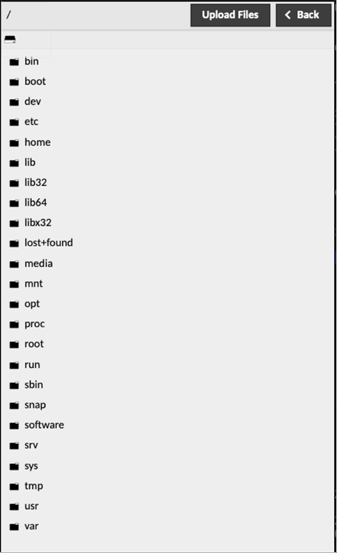

# Transferring files with web shell and web desktop

Files can be transferred to the remote computer by dragging and dropping the files into your browser window, or through using the file browser located in the Guacamole menu. The Guacamole menu is a sidebar which is hidden until explicitly shown. On a desktop or other device which has a hardware keyboard, you can show this menu by pressing Ctrl+Alt+Shift and clicking on the screen. I f you are using a mobile or touchscreen device that lacks a keyboard, you can also show the menu by swiping right from the left edge of the screen. To hide the menu, you press Ctrl+Alt+Shift again or swipe left across the screen.

You can select where to transfer files by clicking the "Devices" option in the Guacamole menu. That will give you a file manager type menu where you can select the directory to transfer files into. 

***Note:*** You will only be able to read or write files in directories that your user account would have access to. This means unless you've created directories where you can write, by default you'll only be able to write into your home directory, /tmp, and mounted volumes.

Double-clicking on any directory will change the current location of the file browser to that directory, updating the list of files shown as well as the "breadcrumbs" at the top of the file browser. Clicking on any of the directory names listed in the breadcrumbs will bring you back to that directory, and clicking on the drive icon on the far left will bring you all the way back to the root level.
Downloads are initiated by double-clicking on any file shown, while uploads are initiated by clicking the "Upload Files" button. Clicking "Upload Files" will open a file browsing dialog where you can choose one or more files from your local computer, ultimately uploading the selected files to the directory currently displayed within the file browser. You can also drag and drop files into the dialog box from your computer's file windows.
The state of all file uploads can be observed within the notification dialog that appears once an upload begins, and can be cleared once completed by clicking the "Clear" button. Downloads are tracked through your browser's own download notification system.

***Note:*** To use web desktop you need to enable web desktop while creating the VM

