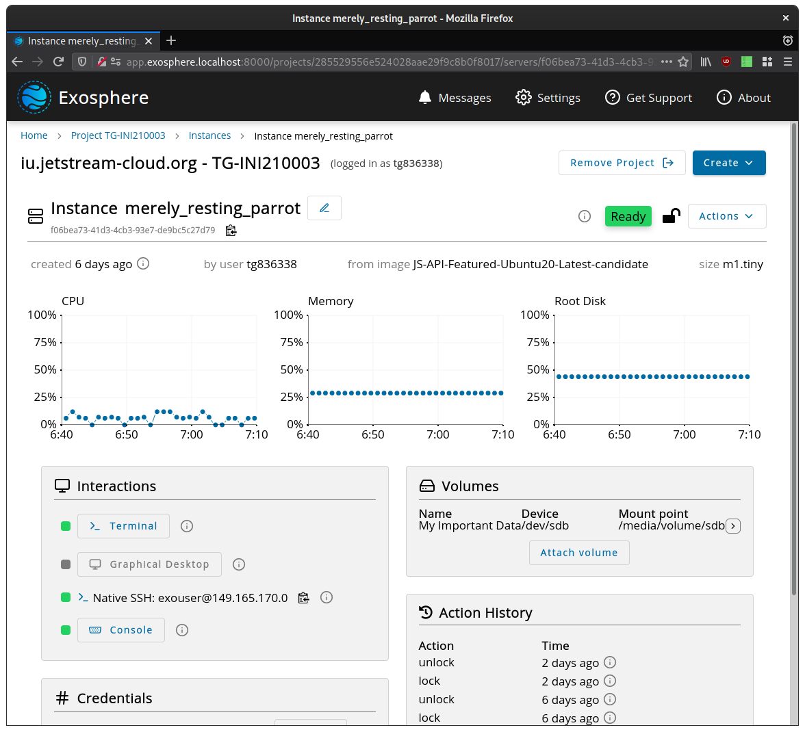

# Exosphere

Exosphere strives to be the most user-friendly interface for research clouds. If you are new to Jetstream2 and unsure which interface to use, Exosphere is a great place to start. Whether you are exploring new software tools, running compute-intensive jobs, teaching a course/workshop, or building a science gateway, Exosphere can likely help you reach your goals. Use Exosphere in your web browser at [https://jetstream2.exosphere.app/](https://jetstream2.exosphere.app/).

Right now, Exosphere supports creating and managing instances. Instances are virtual computers (a.k.a. servers) that run your code, containers, software, and services. When you create an instance, you get helpful features like:

- A one-click web shell (terminal) in your browser
- Optionally, a one-click desktop environment for running graphical software
- A browser-based file upload/download tool
- Resource usage graphs that show how hard your instance is working
- Easy passphrase-based SSH access, if you want it

You can also use volumes to store large data sets, and manage persistent IP addresses for servers and science gateways. More powerful features, like data science workbenches and workflow sharing, are in experimental status now.

With Exosphere, there is no requirement to learn about advanced cloud technologies like virtual networks or SSH keypairs. If your use of Jetstream2 becomes more sophisticated, and you need to reach for more complex tools like the OpenStack CLI or APIs, Exosphere does not get in your way.

## How Exosphere compares with the Horizon dashboard, OpenStack CLI, and APIs

Exosphere supports users who wish to mix their use of Exosphere with other OpenStack interfaces like Horizon dashboard, the OpenStack command-line interface, and the APIs. Generally (and with a few limitations), resources that you create in one interface will show up in other interfaces. They are merely different ways to manage the same infrastructure.

The other OpenStack interfaces support more features of OpenStack that Exosphere doesn't (yet), like Heat for cluster orchestration and Swift for object storage. So, they may better support some advanced cloud use cases than Exosphere, but they are generally less accessible to newer users. The Horizon dashboard, the OpenStack CLI, and the APIs were all built for use by IT engineers, not by researchers and data scientists. For example, in any of these tools you must create a network, subnet, router, security group, and SSH keypair before you can create an instance and connect to it (using an SSH client program and your private SSH key). If your use cases grow sophisticated enough, you may need this lower-level control, but using the Horizon dashboard is sort of like driving a car with a manual transmission. Using the CLI feels somewhat like using Horizon, but now you're shifting gears by typing shell commands instead of clicking buttons. Using the OpenStack APIs directly is like building your own transmission for the car.

Instances created via these other tools do _not_ get a one-click shell, desktop, data upload/download tool, or any of the other interactions that Exosphere sets up for you. If you want these with the other OpenStack interfaces, you must set them up yourself with varying degrees of difficulty.

### How Exosphere compares with Cacao (Atmosphere2)

This section will be populated once [Cacao (Atmosphere2)](../cacao/overview.md) is ready enough to explore and compare.

## Getting Help

In addition to the XSEDE ticketing system, there is an #exosphere-user-support channel in the Jetstream Slack workspace. To request access, please open a ticket from the XSEDE user portal. This support option includes _no_ promise of immediate, real-time assistance, but the Exosphere core developers monitor it and help when they can. Sometimes it's easier to chat with them than wait for ticket notifications.

## Contributing

If you'd like to help build Exosphere or request a new feature, visit the [project on GitLab](https://gitlab.com/exosphere/exosphere){target=_blank}. The Exosphere maintainers strive to provide a welcoming experience for new contributors. At a broader level than Jetstream, the Exosphere project has a [chat room on Matrix/Element](https://riot.im/app/#/room/#exosphere:matrix.org){target=_blank} which is used to coordinate development work, but community members are also welcome to join. Further, the Exosphere team discusses project progress and priorities on a weekly video call on Mondays at 16:00 UTC. You can join at [https://meet.jit.si/exosphere](https://meet.jit.si/exosphere){target=_blank} or dial in at +1.512.647.1431, PIN: 3037 7824 88#. (Find the agenda and notes from previous meetings [here](https://c-mart.sandcats.io/shared/wfRsWBVmJZ3maUn7HMFqNj_MR_Bzy1vob9CzWu1n7QI){target=_blank}.)
