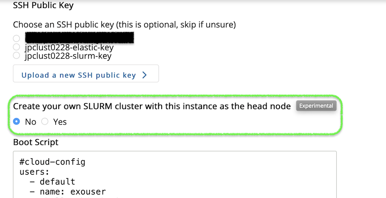

# Push-button Clusters using Exosphere

This guide assumes that you are comfortable creating instances using Exosphere. If you are new to Exosphere, see [Exosphere: Overview](./exo.md).
{: .note}

Exosphere makes it simple to create a virtual Slurm cluster, complete with automatic, elastic scaling of compute nodes. This helps you get started with parallel computing, and to scale up your cluster as your needs grow.

To learn more about virtual clusters, as well as other ways to create them, see [Advanced Capabilities: Virtual Clusters on Jetstream2](../../general/virtualclusters.md).
{: .note}

## Enable Experimental Features in Settings

Open the Settings page (top menu). Ensure that the "Experimental Features" option is enabled.  

## Create a Cluster Head Node Instance 

Select "Create" and then "Instance".


For instance source type select **Rocky Linux 8**. 

Choose a unique name (preferably a short name with no spaces or special characters) for your instance. Ensure there is no existing instance with the same name by looking at the Exosphere instance list page and pressing the "Clear filters" button.

This will be the base name for all resources created for the cluster, including networks, SSH keys, compute nodes, etc.

For flavor choose "m1.small".

Expand "Advanced Options".

Select an SSH key (highly recommended).

You should see an option "Create your own Slurm cluster with this instance as the head node". Select "Yes" for this option.



Click the "Create" button underneath the Boot Script text input area.

Wait until the instance is ready - this could take up to half-an-hour.

## Run a Job on the Cluster

SSH into the new instance as `exouser`. (Alternatively use the web shell.)

Switch to the `rocky` user:

```bash
sudo su - rocky
```

Go to the cluster repository directory: 

```bash
cd ~/CRI_Jetstream_Cluster/
```

Submit a test batch job: 

```bash
sbatch slurm_test.job
```

View the live SLURM logs: 

```bash
sudo tail -f /var/log/slurm/slurm_elastic.log /var/log/slurm/slurmctld.log
```
 
You should see messages indicating a new compute node being created as an OpenStack instance.

Confirm the new compute node instance exists by refreshing Exosphere's instance list page. Its name should begin with the same name as your head node instance, and end with "-compute-0".

Once the job is finished confirm that the compute node is gone by refreshing Exosphere's instance list page.

Check the output of the test batch job by finding a new file ending with `.out` in the directory where you ran `sbatch` and viewing its contents. The file should contain two copies of the hostname of the compute node. For example:

```bash
ls -alt *.out
cat nodes_1.out
```

You should see something like this:

```
$ ls -alt *.out
-rw-rw-r--. 1 exouser exouser 72 Jan 28 19:10 nodes_1.out
$ cat nodes_1.out
yourclustername-compute-0.novalocal
yourclustername-compute-0.novalocal
```

You now have your very own working Slurm cluster. Congratulations!

## Clean-up steps

Once you're done with your cluster, and you want to get rid of the head node instance as well as all the OpenStack resources created for the cluster, run the following commands on the head node instance (in an SSH session or web shell):

```bash
sudo su - rocky
cd ~/CRI_Jetstream_Cluster
./cluster_destroy_local.sh -d
```

Your SSH or web shell session on the head node will be terminated, and you will be disconnected. 

Confirm that the head node instance is gone by refreshing Exosphere's instance list page.
