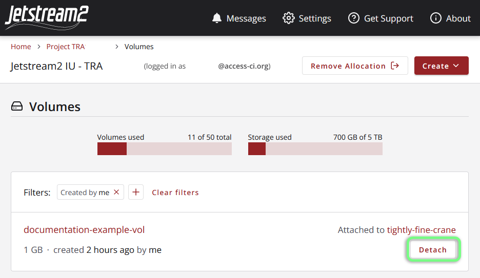
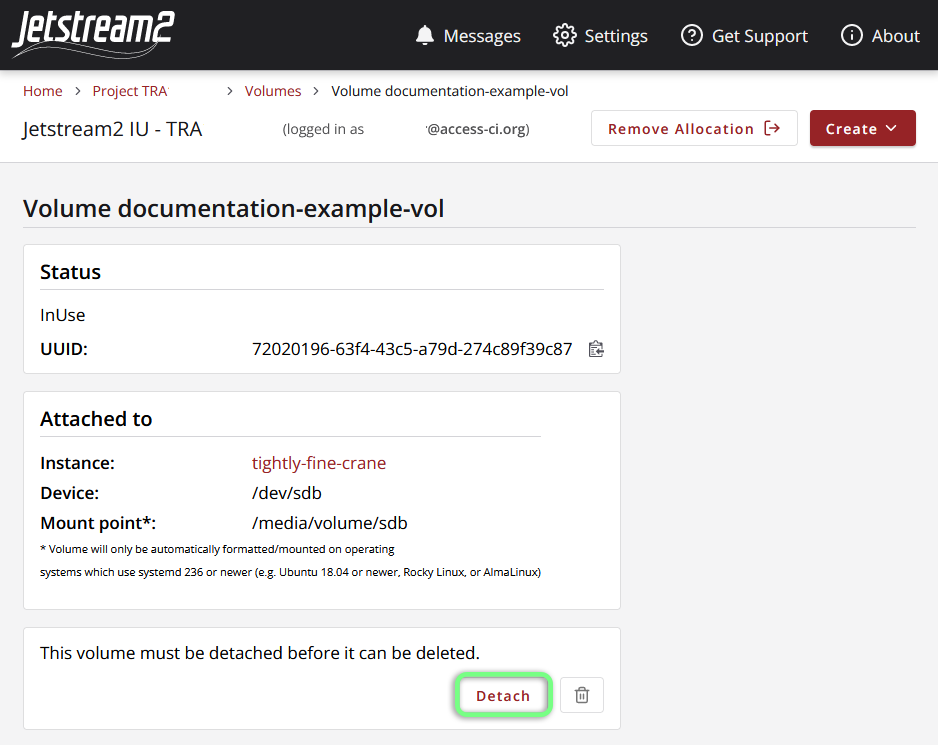
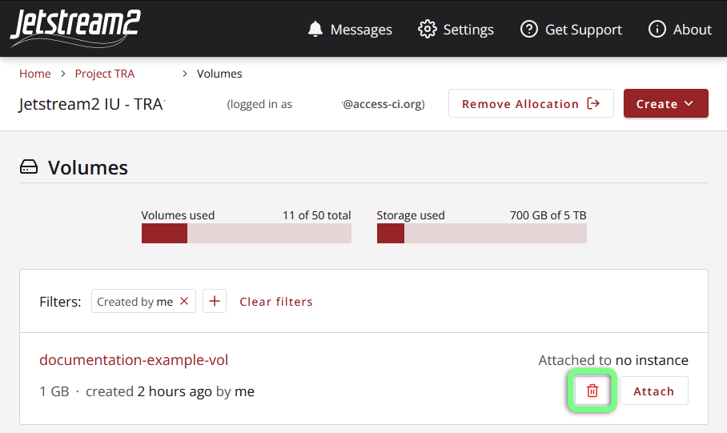
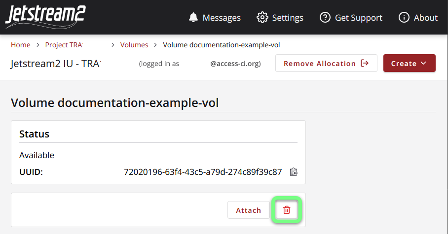

# Using Storage Under Exosphere

## Volumes

For a more robust overview of volumes on Jetstream2, please see [this article on storage](../../general/storage.md)
{: .note}

### Creating a Volume

Volumes can be created in the Exosphere interface under the "Create" dropdown (top-right):

### Attaching your Volume to an Instance

Volumes can be attached from either the *Volumes* section of the Instance Details page, the Volumes List page, or the individual Volume Details page.

| Page             | Location                                                                                                                                               |
|------------------|--------------------------------------------------------------------------------------------------------------------------------------------------------|
| Instance Details |   |
| Volumes List     |                      |
| Volume Details   |                 |

### Accessing an Attached Volume

After successfully attaching a volume to an instance, Exosphere will display the mount point (`/media/volume/my-volume`) to which the volume is attached. This information can also be found on your Instance Details page or Volume Details page.

The mount point is the directory that represents the root of a volume's filesystem and is where you can access files stored in it.

#### Note for older Instances

On older Instances (created before 2/10/2024), the device location (`/dev/sdb`) will also be displayed, and the mount point will match the device location (`/media/volume/sdb`).

### Detaching a Volume

A volume can be detached from an instance on either the Volumes List page or the Volume Details page:

| Volume List                                                                                                              | Volume Details                                                                                                                 |
|--------------------------------------------------------------------------------------------------------------------------|--------------------------------------------------------------------------------------------------------------------------------|
|  |  |

### Deleting a Volume

!!! warning "Volume deletion is permanent"
    Deleting a volume will **permanently** destroy any data stored on it.

***Note:*** A volume cannot be deleted if it is still attached to an instance; it will need to be detached first.
{: .note}

A volume can be deleted on either the Volumes List page or the Volume Details page by clicking the trash can icon:

| Volume List                                                                                                              | Volume Details                                                                                                                 |
|--------------------------------------------------------------------------------------------------------------------------|--------------------------------------------------------------------------------------------------------------------------------|
|      |      |

## File Shares

OpenStack Manila file shares are significantly more complicated to set up than simple volumes; however, unlike simple volumes, file shares can be mounted to and accessed by multiple instances at the same time. Currently, Exosphere does not support the creation or management of Manila shares within its user interface.

Please reference *[Manila - Filesystems-as-a-service - on Jetstream2](../../general/manila.md)* for more information and setup guides.
