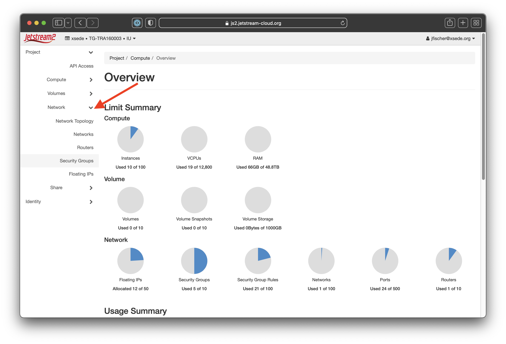
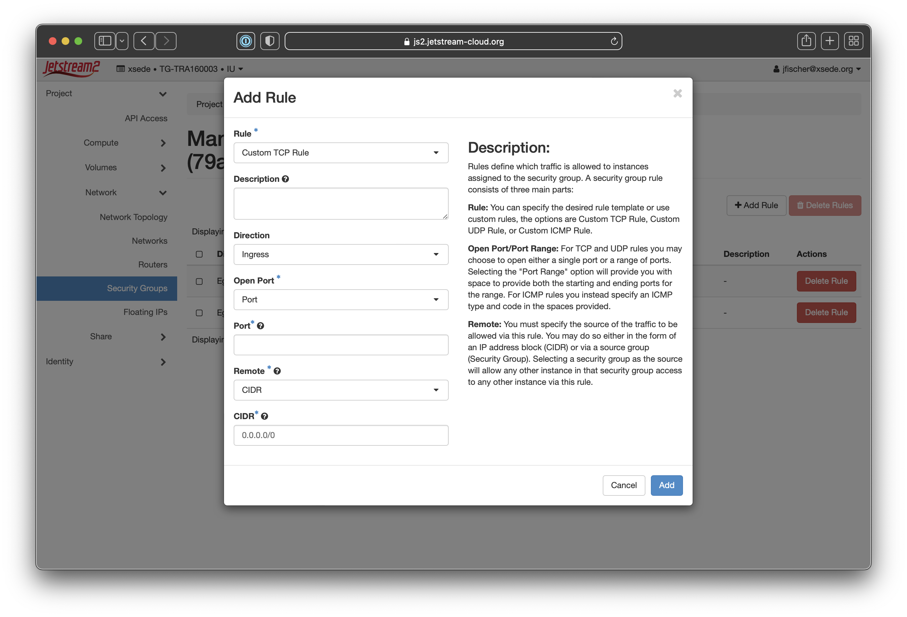
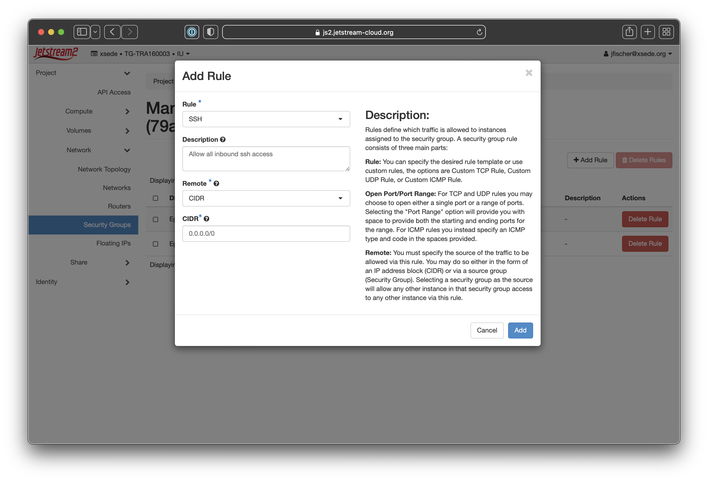
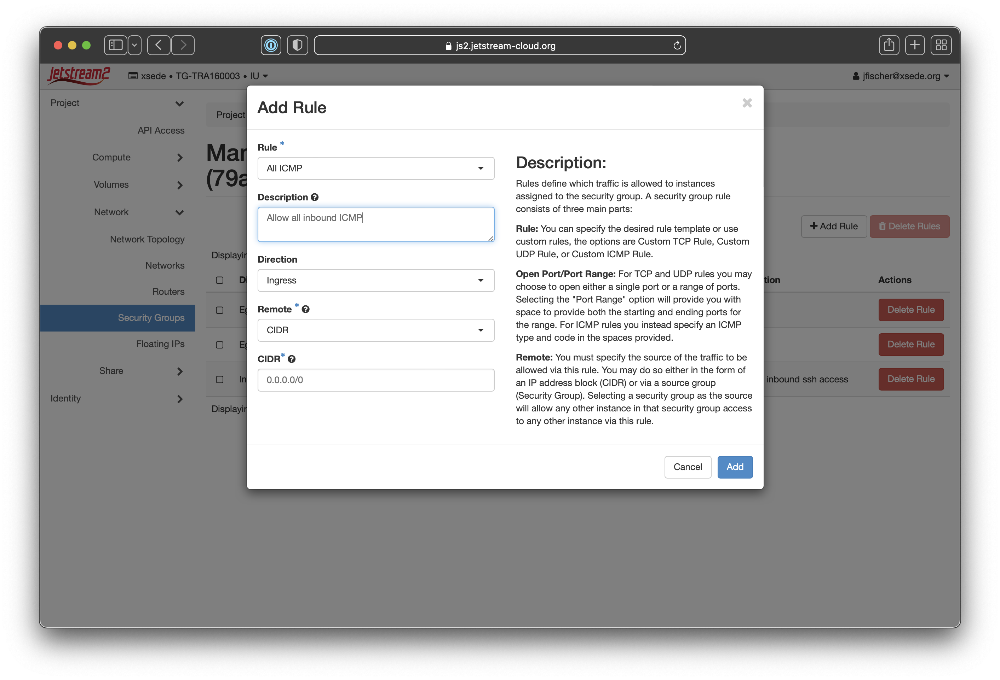

# Security Group Management in Horizon

Security groups can be thought of like firewalls. They ultimately control inbound and outbound traffic to your virtual machines. Under the CLI and Horizon, access defaults to all outbound allowed and **NO** inbound allowed.

To allow access to your VM for things like SSH, you will need to create a security group and add rules to it.

!!! note "Naming and reusing security groups"

    You can reuse a security group many times, so a best practice is to create groups by related services. For instance, you might create a basic group for ssh and icmp (which is what we will show as an example) and then a separate security group for http and https access if you're running a web service on your instance. 

### Creating Security Groups and Rules

This will walk you through creating a basic security group in Horizon and adding a couple of simple access rules.

---

<table style="border-style: none;">
  <tr>
    <th style="width: 550px; word-wrap: break-word;">Action</th>
    <th style="width: 550px; word-wrap: break-word;">Screenshot</th>
  </tr>
</table>

---

{ align=right ; width=50% }

1. Login to the <a href="https://js2.jetstream-cloud.org" target=_blank>Horizon dashboard and</a> make sure you've selected the correct allocation. Select the `Network` tab on the sidebar and click `Security Groups`.

             

---

{ align=right ; width=50% }

2. Once you're on the security group page, you'll need to click the `Create Security Group` button (noted with a red arrow on the screenshot).

             

---

{ align=right ; width=50% }

3. In the popup box that comes up, you'll give your new security group a name (we suggest something like ***my-username-ssh-and-icmp***) and optional description. We recommend giving a meaningful name and noting in the description what your intended purpose is.

             

---

{ align=right ; width=50% }

4. When the creation is successful, it will bring you back to the security group page and note the success in the corner with a green status message. You'll see your new group name at the top where it says **Manage Security Group Rules: your-rule-name**.  You'll then want to click `Add Rule` (noted with a red arrow on the screenshot).

             

---

{ align=right ; width=50% }

5. This will bring up a new dialog box where you can select the parameters for your security group rule.

             

---

{ align=right ; width=50% }

6. If you click the `Rule` dropdown at the top, you'll see a list of common rule types as well as the option for custom rules. For this example, we'll select `SSH` to allow inbound port 22/SSH access.

             

---

{ align=right ; width=50% }

7. We'll fill in the other details needed. We do recommend putting in a description with what the rule does so it's easy to see at a glance. We'll also select CIDR as the remote type and then set ***0.0.0.0/0*** as the CIDR. This allows all traffic to the SSH port.   You can make that be a single IP or a specific CIDR block.   In general, limiting access to specific CIDR blocks or IPs is best.  

For example, you could specify ***129.114.36.0/22*** to limit connections to only Jetstream2 VMs at the TACC regional location.
{: .note}

      

---

{ align=right ; width=50% }

8. When the creation is successful, it will bring you back to the security group page and note the success in the corner with a green status message. You'll see your new rule now on the page.

             

---

{ align=right ; width=50% }

9. You'll need to click the `Add Rule` button a second time and we'll create a second rule for **All ICMP**. This will allow things like incoming ping to check the status of your virtual machine. You'll select `Ingress`, `CIDR`, and set the CIDR to ***0.0.0.0/0*** to allow all hosts to ping your virtual machine.

             

---

{ align=right ; width=50% }

10. As before, when the creation is successful, it will bring you back to the security group page and note the success in the corner with a green status message. You'll see your new rule now on the page.

             

---

You can then add additional rules or additional security groups. This will allow the most basic of access to your VMs.

**We do recommend limiting access as much as possible for best security practices.**
{: .note}
