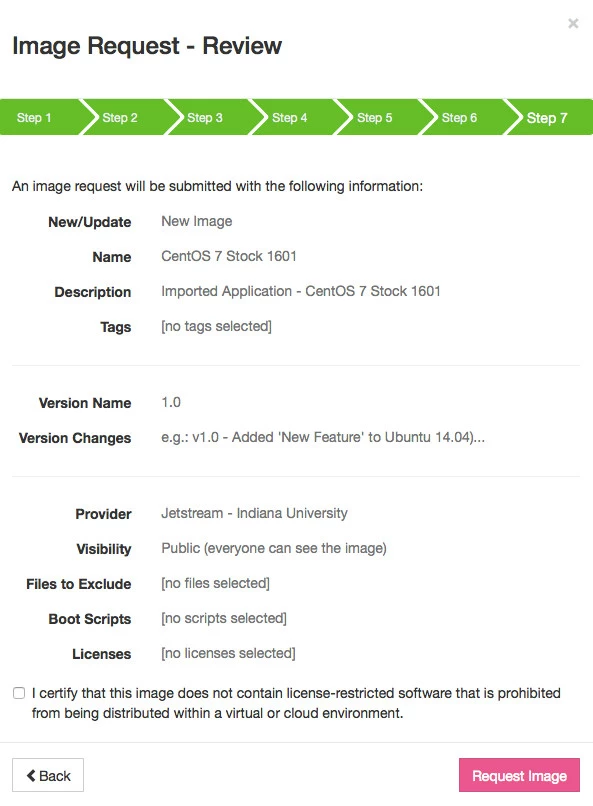

# Request an image of an instance

You can request an image (a type of template for a virtual machine) of a running instance. This saves a complete copy of all changes and updates made to the instance since it was launched so it can be reused at any time. It also saves resources by launching the instance only when you need it.

You also can see the list of all image requests you have made.

You can add a script before requesting the image that executes after an instance using the image is launched and active.

!!! note "PLEASE NOTE"

    Images will get created on the IU cloud by default, no matter which cloud they originated from. They will automatically be synced nightly to the TACC cloud.

!!! warning "CAUTION!"

    The following directories are deleted as part of the imaging process:

    ```
    /home/
    /mnt/
    /tmp/
    /root/
    ```


#### To get started:

* Log in to Jetstream web interface, [https://use.jetstream-cloud.org/](https://use.jetstream-cloud.org/).
* **Detach** all attached volumes from the instance. [Detailed instructions](Detach+a+Volume.md).
* Click `Projects` on the menu bar and open the project with the instance to use for the new image.
* Click the `instance name`. The instance can have a status of **Active** or **Stopped** but it cannot be **Suspended** or **Shelved**.
* In the Actions list on the right, click `Image`.

---

#### Image Request - Image Info

The information you provide on here will help others to discover this image.

{ align=right ; width=300 }

* **Create or Update? (optional)**: The default is to create a new image, but if you are updating an image to a new revision, you can uncheck this box and it will be created as a new version of the same image. You can see examples of this with the Ubuntu 18.04 Featured image on Atmosphere. We recommend you update the image when possible.
* **New Image Name (required)**: Enter the name, up to 30 characters, to assign to the new image. Please DO NOT use the name of an existing featured image. Please be mindful of re-using the name of one of your own existing images.
* **Description of the Image (required)**: The description should include key words that concisely describe the tools installed, the purpose of the tools (e.g., This image performs X analysis), and the initial intent of the machine image (e.g. designed for XYZ workshop).  Include key words that will help users search for this image.
* **Image Tags (optional)**: Click in the field and select tags that will enhance search results for this image. You may include the operating system, installed software, or configuration information (e.g. Ubuntu, NGS Viewers, MAKER, QIIME, etc.).  Tags can be added and removed later, if needed.
* Click **Next**.

</br></br></br></br></br></br></br></br>

---

#### Image Request - Version Info

Versioning is an important part of the imaging process.  Use this information to track how your image changes over time.  This information will also be helpful to others that wish to use your image.

{ align=right ; width=300 }

* **New Version Name (required)**: Enter the new (unique) name or number of the image.  Versioning helps users understand how your changes relate to the overall progress of the Application.  Versions are alphanumeric (e.g. 2.0-stable, 2.1-beta, 2.2-testing).  Limit the name to 30 characters and keep versioning consistent.
* **Change Log (required)**: Concisely describe what you've changed in this specific version.  This description will help users understand how your application as changed over time.
* **Click Next**.

</br></br></br></br></br></br>

---
#### Image Request - Provider

{ align=right ; width=300 }

* Select the cloud provider to use for the image.  If you would like the image to be available on multiple clouds, email help@jetstream-cloud.org.
* Indicate minimum CPU and memory requirements (optional).
* Click **Next**.

</br></br></br></br></br></br></br></br>

---
#### Image Request - Privacy

{ align=right ; width=300 }

* Select the visibility for the image:
    * **Public**: The image will be visible to all users and anyone will be able to launch it.
    * **Private**: The image will be visible only to you and only you will be able to launch it.
    * **Specific Users**: The image will be visible to only you and the users you specify.  Only you and those specific users will be able to launch it.  If you chose Specific Users, select the users who will be able to launch the image.
* **Click Advanced Options** or **Submit**.

Advanced Options will allow you to:

* Exclude files from the image
* Add a deployment script
* Require the user to verify understanding of any license restrictions

</br></br></br></br></br></br>

---
#### Image Request - Exclude Files (advanced option)

{ align=right ; width=300 }

Note the list of directories that will automatically be excluded form the image:

```
/home/
/mnt/
/tmp/
/root/
```

In the box provided, list any additional files or directories to be excluded from the image.  Write one path per line.

</br></br></br></br></br></br></br></br>

---
#### Image Request - Boot Scripts & Licenses (advanced option)

{ align=right ; width=300 }

Deployment scripts are executed when a user launches the image and each time an instance is 'Started', 'Resumed', or 'Restarted'.  These scripts should be able to handled being run multiple times without adverse effects.  

Click **Next** to continue to the next screen without adding a new script or a software license.

* To add a deployment script, click in the search field and search for the title of the script.
* To create a new deployment script:
    * Click **Create New Script**, enter a title for the script, then either click URL and enter the script URL or click Full Text and enter the deployment script.
    * When done, click **Create and Add**, then click **Next**.


* To list any licensed software used in the image and require users to agree to the license agreement before launching, click in the search field and search for the license title.
* To create a new license:
    * **Click Create New License**, enter a title for a license, then either click URL and enter the license URL or click Full Text and enter the full license text.
    * When done, click **Create and Add**, then click **Next**.

</br></br></br></br></br></br>

---
#### Image Request - Review

{ align=right ; width=300 }

On the Review screen, verify the information entered on the previous screens.  Click Back to return to the previous screens and make corrections.  When all is OK, click the checkbox certifying that the license does not contain any license-restricted software that is prohibited from being distributed within a virtual or cloud environment..

* Click **Request Image**.

You will receive an email from Support when the image is completed. Please email questions to [help@jetstream-cloud.org](mailto:help@jetstream-cloud.org).

</br></br></br></br></br></br>

---
